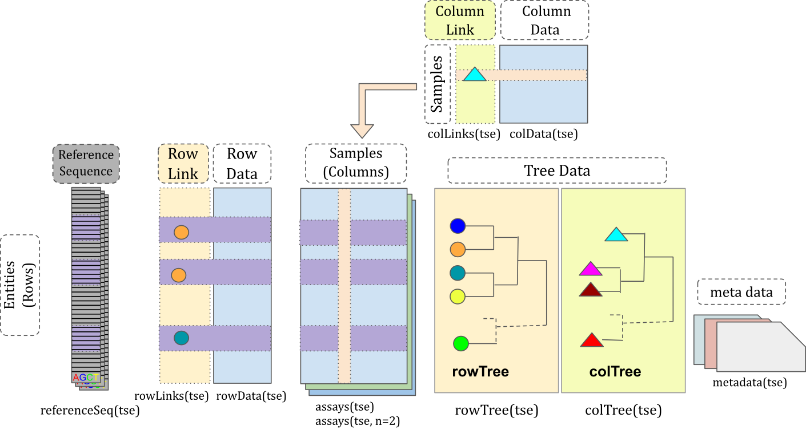

```{r setup, message=FALSE, class.source = 'fold-hide'}
# Get starting time
starting_time <- Sys.time()

################################################################################
# List of packages that we need
packages <- c("ggplot2", "mia", "miaViz")

# Get packages that are already installed installed
packages_already_installed <- packages[ packages %in% installed.packages() ]

# Get packages that need to be installed
packages_need_to_install <- setdiff( packages, packages_already_installed )

# Loads BiocManager into the session. Install it if it not already installed.
if( !require("BiocManager") ){
    install.packages("BiocManager")
    library("BiocManager")
}

# If there are packages that need to be installed, installs them with BiocManager
# Updates old packages.
if( length(packages_need_to_install) > 0 ) {
   install(packages_need_to_install, ask = FALSE)
}

# Load all packages into session. Stop if there are packages that were not
# successfully loaded
if( any(!sapply(packages, require, character.only = TRUE)) ){
    stop("Error in loading packages into the session.")
}

################################################################################
# Additional setup

# Set black and white theme for figures, and Arial font
theme <- theme_bw() + theme(text = element_text(family = "Arial"), 
                            panel.border = element_blank(), 
                            panel.grid.major = element_blank(),
                            panel.grid.minor = element_blank(), 
                            axis.line = element_line(colour = "black"))
theme_set(theme)
```


#### EuroBioC2023

- European Bioconductor Conference 2023
- Ghent, Belgium
- September 21, 2023; 13:30 (CEST)
- **See the poster also (miaverse – microbiome analytics framework in SummarizedExperiment family)!**

#### Presenter information

All authors are affiliated to [Turku Data Science Group in University of Turku, Finland.](https://datascience.utu.fi/)


- **Tuomas Borman -- doctoral researcher**
- Chouaib Benchraka -- doctoral researcher
- Leo Lahti -- group leader

---

## Learning goals

1.  Microbiome research studies interactions between microbes (and human, environment...)
2.  Big data requires efficient tools to manipulate the data
3.  miaverse is a SummarizedExperiment framework for microbiome analytics

{width="400"}

## Motivation

### Microbiome research

- Microbiome is a composition of microbes in well-defined area (gut, skin, mouth...)
- Bilateral interaction between human and microbiome --> affects both health and disease.
- The research is based on sequencing (characterization of genes and species).
- Nowadays, multiomics approach is more common (integration of taxonomy information with metabolite data, for example)
- Computational methods are the new microscope
- The research has expanded rapidly in previous years

```{r pubmed_fig, fig.width=6, fig.cap="PubMed publications per year with a search term 'microbiome' (fetched: Sep 5, 2023)", class.source = 'fold-hide'}
# Plot publication graph
path <- "data/PubMed_Timeline_Results_by_Year.csv"
df <- read.csv(path, skip = 1)

x <- "Year"
y <- "Count"

plot <- ggplot(df, aes(x = .data[[x]], y = .data[[y]])) +
    geom_bar(stat="identity")
plot
```

### Big data

- Most of the cohort studies require multiple types of data, for instance microbiome, phenotype and other omics data.
- Linking these types of data could present multiple challenges; to mention:
  * Different sources the data is coming form, could use different types of key identifier of the samples or subjects of the study; which could poses a problem in some cases for linking the data together.
  * The choice of the data structure to combine and store these mulitple types of data is critical as well, in terms of the management, handling and wrangling of the data; to be able to perform the analysis.
- Cohort datasets are large in size, which mostly one cannot conduct an analysis using a normal computer with limited hardware; HPC and cloud computing services are required in this case. 
- Last but not least, a quality check reporting of the constructed object is substantially important to verify the correctness of the building process.   

Regarding the choice of the data strcuture to handle cohorts with muliple data types or sources [MultiAssayExperiment](https://bioconductor.org/packages/release/bioc/html/MultiAssayExperiment.html),
is considered to be very liable in such situation, easing-up the management and wrangling of the data; once is construced correctly. Moreover, several R packages frameworks are increasingly integrating 
[MultiAssayExperiment](https://bioconductor.org/packages/release/bioc/html/MultiAssayExperiment.html) and the [SummarizedExperiment](https://bioconductor.org/packages/release/bioc/html/SummarizedExperiment.html)class, to provide users with a reliable and ease of use data structure.

## miaverse (MIcrobiome Analysis) {width="50"}

- A framework for microbiome analytics
    - [mia (analysis)](https://bioconductor.org/packages/release/bioc/html/mia.html)
    - [miaViz (visualization)](https://bioconductor.org/packages/release/bioc/html/miaViz.html)
    - [miaSim (simulation)](https://bioconductor.org/packages/release/bioc/html/miaSim.html)
    - [Orchestrating Microbiome Analysis, OMA (tutorial book)](https://microbiome.github.io/OMA/)
- Based on _TreeSummarizedExperiment (TreeSE)_ class
    - Supports hierarchical data
    - _phyloseq_ class is a subset of _TreeSE_
    - Extension of _SingleCellExperiment_ class
    - miaverse is compatible with other _SummarizedExperiment_ frameworks
- Purpose to offer tools and tips for microbiome data analysis
- Enables development of versatile analytical workflows in microbiome data science
    - Supports multiomics (_MultiAssayExperiment_ class)
    - Scalable
    - Standardized

{width="700"}

## The workflow

### Importing the dataset

We get the data from [MGnify database](https://www.ebi.ac.uk/metagenomics). It
is a EMBL-EBI's database for metagenomic data. This large microbiome database
can be accessed with _MGnifyR_ package which nowadays support _TreeSE_. The
package will be submitted to Bioconductor's next release.

We chose this dataset...

As loading takes some time, the dataset is already loaded.

For other available datasets and importing methods, check [OMA](https://microbiome.github.io/OMA/containers.html#example-data).

```{r}
# library(MGnifyR)
# mg <- MgnifyClient()
# 
# analyses <- searchAnalysis(mg, "studies", "MGYS00005128")
# analyses <- searchAnalysis(mg, "studies", "MGYS00000596")
```

```{r}
# mae <- getResult(mg, analyses)
```

### Thanks!


- more material in OMA
- miaverse logo
- project website and QR also.
- Contact info
- Poster info


## Session info

```{r sessioninfo, class.source = 'fold-hide'}
sessionInfo()
```
