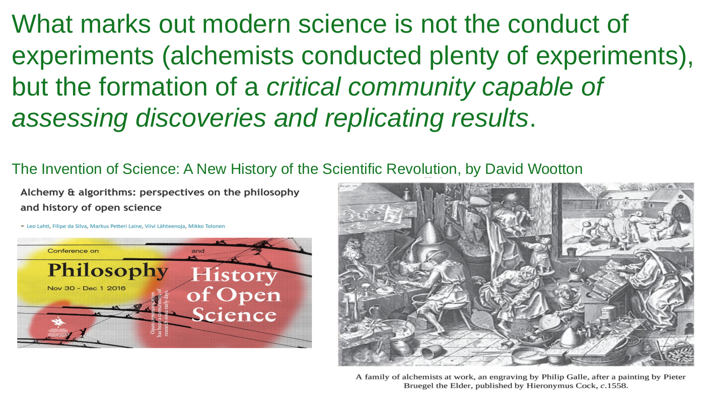
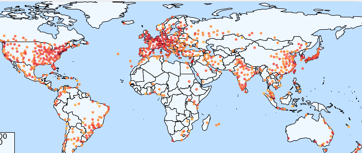
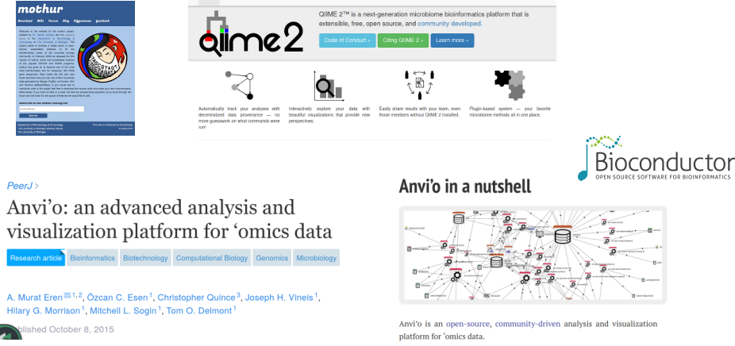
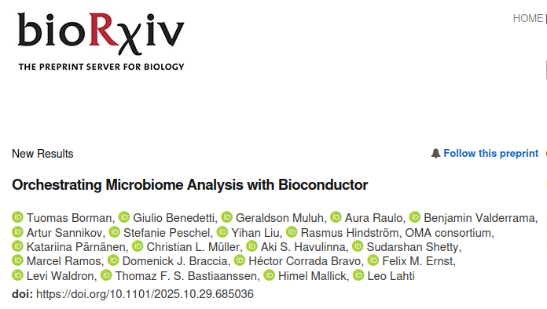
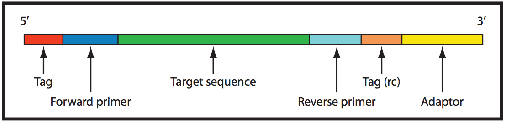
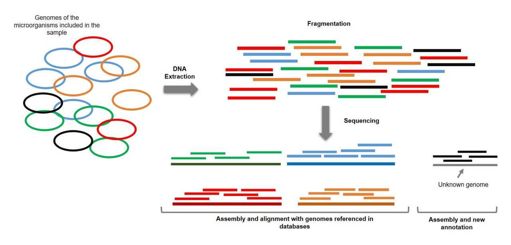

## About me {.smaller}

::: columns

::: {.column width="35%"}

{fig-align="left" width="45%"}

**Tuomas Borman**

- Doctoral Researcher at the University of Turku, Finland ([Turku Data Science Group](https://datascience.utu.fi/))

- Developing microbiome data science R/Bioconductor packages
:::

::: {.column width="65%"}

```{r}
#| label: personal_timeline
#| fig-width: 8
#| fig-height: 6

library(ggplot2)
library(ggrepel)

timeline_arrows <- data.frame(
  start = c(2017, 2020, 2023, 2024, 2025, 2020),
  end   = c(2022, 2023, 2026, 2026, 2026, 2026),
  y     = c(0.20, 0.10, 0.05, -0.15, -0.25, -0.35),
  label = c(
    "BSc + MSc (Tech)",
    "BSc + MSc (Econ)",
    "DSc (Tech)",
    "Board Member\nFinnish Society for Bioinformatics",
    "Board Member\nBioconductor CAB",
    "Researcher\nTurku Data Science Group"
  ),
  type = c("Academic", "Academic", "Academic", "Service", "Service", "Service"),
  ongoing = c(FALSE, FALSE, TRUE, TRUE, TRUE, TRUE)
)

timeline_arrows$mid <- (timeline_arrows$start + timeline_arrows$end) / 2

ggplot() +
  annotate(
    "segment", x = 2016, xend = 2026, y = 0, yend = 0,
    arrow = arrow(length = unit(0.4, "cm"), type = "closed"),
    linewidth = 1.2, color = "black"
  ) +
  geom_segment(
    data = timeline_arrows,
    aes(x = start, xend = end, y = y, yend = y,
        color = type, linetype = ongoing),
    arrow = arrow(length = unit(0.35, "cm"), type = "closed"),
    linewidth = 2
  ) +
  geom_label_repel(
    data = timeline_arrows,
    aes(x = mid, y = y, label = label),
    size = 4.5,
    fontface = "bold",
    box.padding = 0.5,
    point.padding = 0.8,
    direction = "y",
    nudge_y = 0.05,
    max.overlaps = Inf,
    segment.color = NA,
    fill = "white",
    label.size = 0
  ) +
  scale_color_manual(values = c("Academic" = "#2C3E50", "Service" = "#2C3E50")) +
  scale_linetype_manual(values = c("FALSE" = "solid", "TRUE" = "dashed")) +
  scale_x_continuous(breaks = 2017:2026, limits = c(2016, 2026)) +
  scale_y_continuous(limits = c(-0.4, 0.35)) +
  theme_minimal(base_size = 14) +
  theme(
    axis.title = element_blank(),
    axis.text.y = element_blank(),
    axis.text.x = element_text(size = 12),
    axis.ticks = element_blank(),
    panel.grid = element_blank(),
    legend.position = "none"
  )
```

:::

:::

## European Bioconductor Conference 2026 in Turku!

```{r}
#| label: show_eurobioc
#| fig-width: 10
#| fig-height: 10
#| fig-align: right
#| eval: true

library(webshot2)
library(magick)

# Take the screenshot and save to a temporary file
tmpfile <- tempfile(fileext = ".png")

temp <- webshot(
    url = "https://eurobioc2026.bioconductor.org/",
    file = tmpfile
)
temp
```

::: {.callout-tip appearance="simple" title="" icon=false}
[eurobioc2026.bioconductor.org](https://eurobioc2026.bioconductor.org){preview-link="true"}
:::

## Topics

Week 1. Ecosystems  
Week 2. End-to-end workflow  
Week 3. Statistical analysis

# Microbiome data science ecosystems

## Bioconductor

- Community-driven, global open-source project
- Started in 2001 from genomics
- High impact across bioinformatics

{fig-alt="Bioconductor logo." fig-align="right" width="10%"}

::: notes
- Project for developing software in bioinformatics.
- Over 1.5 million distinct IPs per year are downloading.
- 50,000+ citations in PubMed
:::

## Collaborative development



::: notes

- Alchemists tried to do gold from inexpensive materials (iron, urine) in middle ages and before and after that
- They did lots of studies which of course failed. But instead of criticizing the theory, they were blaming the laboratory equipment.
- Also, if experiments seemed to be working, they did not replicate the results.

- Closed communities without critisism.

- Chemistry as a field of science was formed when they started to form communities that criticized the theories which led to advancements

- Same goes with bioinformatics. That is why communities and open science are very important.
- Open source code, publishing code and data.

Science is a community effort: **quality & impact**
:::

## Collaborative development

- Software & data repository
- Tutorials & documentation
- Community support & events

{width="327"}

::: notes
- Bioconductor is based on collaborative developments
- Everyone can contribute. Open access.
- Documentation helps to replicate results and critically assess the methods
- Community building is important in building community that can assess discoveries
- Conferences in North America, Asia and Europe
:::

## Open (microbiome) data science ecosystems



::: notes
- Several microbiome data cience community exist
- They differ from their scope and community, but they are also overlapping

QIIME2 you can do the upstream and downstream analysis, but Bioconductor aces in statistical analysis.

Bioconductor emphasizes interoperability across ecosystems. You can utilize QIIME2 in taxonomy mapping and Bioconductor in statistical analysis. From ecosystem to ecosystem, from R to Python.

All these ecosystems have own pros and cons, and you should be aware that they exist.
:::

## Bioconductor software

-   \~2,300 R packages
-   Review, testing, documentation

```{r}
#| label: bioc_packages
#| eval: true

# Get packages and info based on their BiocViews
pkgs <- BiocPkgTools::biocPkgList()
#
pkgs[["SE"]] <- sapply(pkgs$Depends, function(x) any(grepl("summarizedexperiment", x, ignore.case = TRUE)) )
fields <- sapply(pkgs$biocViews, function(x){
    field <- "Other"
    if( any(grepl("genomic|genetic|gene|genom|DNA", x, ignore.case = TRUE)) ){
        field <- "Genomics"
    }
    if( any(grepl("proteomics|protein", x, ignore.case = TRUE)) ){
        field <- "Proteomics"
    }
    if( any(grepl("metabolomics|metabolome|metabolite|Lipidom|massspectro", x, ignore.case = TRUE)) ){
        field <- "Metabolomics"
    }
    if( any(grepl("transcripto|RNA-seq|RNA", x, ignore.case = TRUE)) ){
        field <- "Transcriptomics"
    }
    if( any(grepl("immuno", x, ignore.case = TRUE)) ){
        field <- "Immunology"
    }
    if( any(grepl("cytom", x, ignore.case = TRUE)) ){
        field <- "Cytometrics"
    }
    if( any(grepl("microarray|chip", x, ignore.case = TRUE)) ){
        field <- "Microarray"
    }
    if( any(grepl("single-cell|singlecell", x, ignore.case = TRUE)) ){
        field <- "Single-cell"
    }
    if( any(grepl("metagenom|microbiome|16S|microbiota|amplicon|shotgun|microb|metatranscript|metametabolo|metaproteo", x, ignore.case = TRUE)) ){
        field <- "Microbiome"
    }
    return(field)
})
pkgs[["Field"]] <- fields
pkgs[pkgs[["Package"]] %in% c("mia", "miaViz", "miaSim", "iSEEtree", "HoloFoodR", "MGnifyR"), "Field"] <- "Microbiome"
# Get download stats 
df <- BiocPkgTools::biocDownloadStats()
# Subset to include only packages which BiocView we have
df <- df[df$Package %in% pkgs$Package, ]
# submitted <- BiocPkgTools::firstInBioc(df)
# df <- df[df$Package %in% pkgs$Package, ] # Take into account only current packages
pkgs <- pkgs[, c("Package", "SE", "Field")]
# Get table that shows which package is available in each date
dates <- df$Date |> unique()
dates <- dates[ dates < lubridate::floor_date(Sys.time(), "month") ]
available <- lapply(dates, function(date){
    temp <- df[df[["Date"]] == date, ]
    temp <- temp[match(unique(df$Package), temp$Package), ]
    temp <- temp[["Nb_of_distinct_IPs"]] > 0 | temp[["Nb_of_downloads"]] > 0
    temp[is.na(temp)] <- FALSE
    temp <- as.numeric(temp)
    return(temp)
})
available <- do.call(cbind, available) |> as.data.frame()
rownames(available) <- unique(df$Package)
colnames(available) <- dates
#
ind <- pkgs[match(unique(df$Package), pkgs$Package), "Field"][[1]]
pkgs_date <- rowsum(available, group = ind)
# Put into long format
library(tidyverse)
pkgs_date <- pkgs_date %>%
    rownames_to_column("Field") %>%
    pivot_longer(
        cols = colnames(pkgs_date)[ !colnames(pkgs_date) %in% c("Field")], 
        names_to = "Date",
        values_to = "N"
    )
pkgs_date[["Date"]] <- as.Date(pkgs_date[["Date"]])

# Create a plot that shows number of package through date
p1 <- ggplot(pkgs_date, aes(x = Date, y = N, fill = Field)) +
    geom_area() + theme_classic() + scale_fill_brewer(palette = "Paired") +
    labs(x = "Year", y = "Number of packages") +
    scale_x_date(
        expand = c(0, 0),
        limits = c(min(pkgs_date[["Date"]]), max(pkgs_date[["Date"]]))
    ) +
    scale_y_continuous(expand = c(0, 0)) +
    theme_classic(base_size = 18)
```

```{r}
#| label: number_of_users
#| fig-width: 15

library(BiocPkgTools)
library(ggplot2)
library(scales)
library(patchwork)

df <-biocDownloadStats()
df <- df[df$Package == "mia", ]

years <- firstInBioc(df)[["Year"]]:as.integer(format(Sys.Date(), "%Y"))

years <- 2009:as.integer(format(Sys.Date(), "%Y"))

base_url <- "https://bioconductor.org/packages/stats/bioc"
all_data <- list()

for (yr in years) {
    url <- sprintf("%s/bioc_%d_stats.tab", base_url, yr)
    # try downloading safely
    try({
        df <- read.delim(url)
        df$Year <- yr
        all_data[[as.character(yr)]] <- df
    }, silent=TRUE)
}

all_data <- do.call(rbind, all_data)
df <- all_data[all_data[["Month"]] == "all", ]

df[["date"]] <- as.Date(paste0(df[["Year"]], "-01-01"))

p2 <- ggplot(df, aes(x = date, y = Nb_of_distinct_IPs)) +
    geom_col(fill = "gray", colour = "black") +
    scale_y_continuous(
        labels = label_number(scale_cut = cut_si("")),
        expand = c(0, 0)
    ) +
    scale_x_date(
        expand = c(0, 0),
        limits = c(min(df[["date"]]), max(df[["date"]]))
    ) +
    labs(
        x = NULL,
        y = "Number of downloads from distinct IPs",
    ) +
    theme_classic(base_size = 18) 

p1 + p2
```

::: notes
1.  Popularity has grown.
2.  Broad range of fields (microbiome is rather small, but steadily raising \~ 50 packages)
3.  Over 2,300 R packages
4.  Not limited to R, but R has been the main language. Activity in Python and Julia.
5.  Special abut Bioconductor is the rather strict requirements which ensure the high-quality.

Review process when submitting (novel, relevant, works as it should be, documentation is sufficient) Testing is done automatically (daily). Software must be accessible. --\> documentation must be good
:::


## Bioconductor ecosystems

```{r}
#| label: microbiome_bioconductor
#| fig-width: 15
#| fig-height: 6

library(ggplot2)
library(ggrepel)

# Timeline data
timeline_data <- data.frame(
    year = c(2012, 2015, 2017, 2019),
    event = c(
        "phyloseq\nMcMurdie and Holmes, 2013",
        "SummarizedExperiment\nHuber et al., 2015",
        "SingleCellExperiment\nAmezquita et al., 2020", 
        "TreeSummarizedExperiment\nHuang et al., 2021"
    )
)

# Create a single polygon for the entire arrow (rectangle + arrowhead)
arrow_data <- data.frame(
    x = c(2021, 2024.5, 2024.5, 2025, 2024.5, 2024.5, 2021),
    y = c(-0.14, -0.14, -0.16, -0.10, -0.04, -0.06, -0.06)
)

ggplot(timeline_data, aes(x = year, y = 0)) +
    # Base timeline
    annotate(
        "segment", x = 2011, xend = 2025, y = 0, yend = 0,
        arrow = arrow(length = unit(0.4, "cm"), type = "closed"),
        linewidth = 1.5, color = "gray40"
        ) +
    
    # Timeline points and segments
    geom_point(size = 5, color = "#2C3E50") +
    
    # Repelled labels
    geom_label_repel(
        aes(
          label = event),
          direction = "y",
          nudge_y = 0.02,
          box.padding = 0.4,
          point.padding = 0.5,
          size = 5,
          fontface = "bold",
          color = "#34495E",
          segment.color = "gray60"
        ) +
    
    # mia: draw arrow-box from 2021 to 2025
    geom_polygon(
        data = arrow_data,
        mapping = aes(x = x, y = y),
        fill = "white", color = "black", linewidth = 0.8
        ) +
    annotate(
        "text", x = 2022.75, y = -0.10,
        label = "OMA\n(Borman et al., 2025)",
        size = 5, fontface = "bold", color = "black", lineheight = 1.1
        ) +
    
    # Final theming
    scale_x_continuous(
        breaks = c(timeline_data$year, 2021, 2025),
        limits = c(2010, 2025)
        ) +
    scale_y_continuous(limits = c(-0.25, 0.3)) +
    theme_minimal(base_size = 15) +
    theme(
        axis.title = element_blank(),
        axis.text.y = element_blank(),
        axis.text.x = element_text(size = 16),
        axis.ticks = element_blank(),
        panel.grid = element_blank(),
        legend.position = "none",
        plot.title = element_text(face = "bold", size = 16, hjust = 0.5)
    )
```

::: notes
Over the years, several approaches to data organization have been developed. One of the first widely adopted data containers in microbiome research was `r BiocStyle::Biocpkg("phyloseq")` [@McMurdie2013], designed for 16S amplicon sequencing data. However, it has limitations, particularly in linking multiple experiments and ensuring interoperability between tools in Bioconductor.

`r BiocStyle::Biocpkg("SummarizedExperiment")` (SE) [@Huber2015], on the other hand, was introduced as a general-purpose container for biological data and has become the most widely used format within the Bioconductor ecosystem. It has since been extended to more specialized formats, including `r BiocStyle::Biocpkg("SingleCellExperiment")` [@Amezquita2020] for single-cell data and `r BiocStyle::Biocpkg("TreeSummarizedExperiment")` (TreeSE) [@Huang2021], which is tailored for microbiome datasets.
:::

## Orchestrating Microbiome Analysis, OMA

```{r}
#| label: mia_stats
#| eval: true

library(BiocPkgTools)

perc <- pkgDownloadRank("mia")
perc <- paste0(perc, "%")

df <-biocDownloadStats()
df <- df[df$Package == "mia", ]

years <- firstInBioc(df)[["Year"]]:as.integer(format(Sys.Date(), "%Y"))

base_url <- "https://bioconductor.org/packages/stats/bioc/mia"
all_data <- list()

for (yr in years) {
    url <- sprintf("%s/mia_%d_stats.tab", base_url, yr)
    # try downloading safely
    try({
        df <- read.delim(url)
        df$Year <- yr
        all_data[[as.character(yr)]] <- df
    }, silent=TRUE)
}

all_data <- do.call(rbind, all_data)
df <- all_data[all_data[["Month"]] == "all", ]

last_year <- sort(df[["Year"]])[ which(sort(df[["Year"]]) == as.integer(format(Sys.Date(), "%Y")))-1 ]

num_downloads <- df[df[["Year"]] == last_year, "Nb_of_distinct_IPs"]
num_downloads <- floor(num_downloads / 1000) * 1000

num_downloads <- paste0(format(num_downloads, big.mark = ","))
```

-   Microbiome data science ecosystem
-   "Downstream", statistical analysis
-   Microbiome Analysis (`r BiocStyle::Biocpkg("mia")`): \> `r if(exists("num_downloads")) num_downloads else "*ERROR*"` yearly downloads from distinct IPs (top `r if(exists("perc")) perc else "*ERROR*"` in Bioconductor)

::: {style="text-align: right;"}
 
:::

::: notes
1.  Within Bioconductor, we have developed microbiome data science ecosystem
2.  For downstream analysis
3.  Aligned and tightly linked with broader Bioconductor ecosystem
:::

## 

[](https://www.biorxiv.org/content/10.1101/2025.10.29.685036v1)

::: notes
Preprint available
:::

## Benefits

1.  Tightly linked with broader Bioconductor ecosystem
2.  Improved scalability
3.  Improved multi-table integration

::: notes
1.  We use same data format as broader Bioconductor ecosystem. Some of you might know phyloseq. That was specifically designed for 16S amplicon data, and is not supported outside its ecosystem. Moreover, microbiome data science is nowadays more than sequencing data, it links different fields from metabolomics to genomics. Same data format allows us to use methods from different fields.
2.  The ecosystem is more scalable; speed and memory wise than phyloseq and its more efficient alternative, speedyseq. It is not uncommon anymore that there are tens of thousands of samples and features so we need efficient software to run these big datasets.
3.  This ecosystem allows us to link multiple tables together, facilitating multi-omics integration by supporting management of this kind of complex datasets.
:::

## Community-driven ecosystem of tools {.smaller}

::::: columns
::: {.column width="70%"}
-   `r BiocStyle::Biocpkg("mia")` (Data analysis)
-   `r BiocStyle::Biocpkg("miaViz")` (Visualization)
-   `r BiocStyle::Biocpkg("miaSim")` (Simulation)
-   [miaTime](https://github.com/microbiome/miaTime) (Time series analysis)
-   `r BiocStyle::Biocpkg("miaDash")` (Graphical user interface)
-   `r BiocStyle::Biocpkg("iSEETree")` (Interactive visualization)
-   [Expanded by independent developers](https://microbiome.github.io/OMA/docs/devel/pages/miaverse.html#sec-packages)
:::

::: {.column width="30%"}
{fig-alt="mia logo." width="20%"} {fig-alt="MGnifyR logo." width="20%"} {fig-alt="HoloFoodR logo." width="20%"} {fig-alt="iSEE logo." width="20%"} {fig-alt="MAE logo." width="20%"} {fig-alt="SE logo." width="20%"} {fig-alt="SCE logo." width="20%"} {fig-alt="scater logo." width="20%"} {fig-alt="benchdamic logo." width="20%"} {fig-alt="netcomi logo." width="20%"} {fig-alt="radEmu logo." width="20%"} {fig-alt="DESeq2 logo." width="20%"} {fig-alt="Biobakery logo." width="20%"} {fig-alt="anansi logo." width="20%"}
:::
:::::

::: notes
Ecosystem of packages developed by the community. mia provides the basic operations in microbiome data analysis. miaViz has the methods for visualization.

Developed by independent developers who have started to support the ecosystem.
:::

## Orchestrating Microbiome Analysis with Bioconductor

-   Resources and tutorials for microbiome analysis
-   Community-built best practices
-   Open to contributions!

::: callout-tip
## Go to the Orchestrating Microbiome Analysis (OMA) online book

[bioconductor.org/books/release/OMA/](https://bioconductor.org/books/release/OMA/){preview-link="true"}
:::

::: notes
To support users and to collect best practices, there is online book available.
:::

## Take home message

1. Community is the key

# Data containers

## Data containers

- The core of software
- Structured, standardized way to manage complex data
- Enables modular, efficient workflows

```{r}
#| label: data_container

# Load libraries
library(ggplot2)
library(ggforce)

# Adjusting the text positions for better alignment
ellipse_data <- data.frame(
    x = c(0, 0, 0),         # Centers of ellipses
    y = c(2, 1, 0),         # Centers of ellipses
    a = c(4, 3, 2),         # Widths of ellipses
    b = c(3, 2, 1),         # Heights of ellipses
    label = c("COMMUNITY", "METHODS", "DATA CONTAINER"),  # Labels for each ellipse
    label_y = c(4, 1.75, 0) # Adjusted vertical positions for labels
)

# Plot with adjusted labels
ggplot() +
    geom_ellipse(data = ellipse_data, 
                 aes(x0 = x, y0 = y, a = a, b = b, angle = 0),
                 color = "darkgreen", fill = "grey90", alpha = 0.7) +
    geom_text(data = ellipse_data, 
              aes(x = x, y = label_y, label = label), 
              size = 5, fontface = "bold") +
    coord_fixed() +
    theme_void()
```

::: {.notes}

The core of software is formed by data containers.

Structured way to present complex data. Interlinks tables and data types.

In biology, usually we have abundance table, sample metadata, taxonomy table, phylogeny, ...

Managing this complex data set becomes a burden and lead easily to errors.

:::

##

```{r}
#| label: pages_and_book

library(magick)

img1 <- image_read("images/pile_of_papers.png")
img2 <- image_read("images/book.png")
arrow <- image_blank(width = 500, height = 1000, color = "none") %>%
  image_annotate("→", size = 200, gravity = "center", color = "black")

# Combine images with the arrow
final_image <- image_append(c(img1, arrow, img2), stack = FALSE)

# Display the final image
final_image
```

::: {.notes}

Imagine pile of paper sheets that are unordered. Then imagine a book that holds these same pages in structured way. Would you rather read 100 pages from pile of mess or from book?

:::

##

```{r}
#| label: data_and_data_container

library(magick)

img1 <- image_read("images/unorganized_data.png")
img2 <- image_read("images/TreeSE.png")
img2 <- image_scale(img2, "125%")
arrow <- image_blank(width = 500, height = 1000, color = "none") |>
  image_annotate("→", size = 200, gravity = "center", color = "black")

# Combine images with the arrow
final_image <- image_append(c(img1, arrow, img2), stack = FALSE)

# Display the final image
final_image
```

::: {.notes}

The same idea goes with the data containers. Instead of managing tables separately you can put them to this data container.

:::

## Optimal container for microbiome data? {auto-animate=true}

## Optimal container for microbiome data? {auto-animate=true}

- **Multiple assays**: seamless interlinking

::: {.notes}

Original assay and transformations, along with different experiments

:::

## Optimal container for microbiome data? {auto-animate=true}

- **Multiple assays**: seamless interlinking
- **Hierarchical data**: supporting samples & features

::: {.notes}

Phylogeny and sample hierarchy (patients are relatives, or sampling places can be structured hierarchically etc)

:::

## Optimal container for microbiome data? {auto-animate=true}

- **Multiple assays**: seamless interlinking
- **Hierarchical data**: supporting samples & features
- **Side information**: extended capabilities & data types

::: {.notes}

Sample metadata, taxonomy table...

:::

## Optimal container for microbiome data? {auto-animate=true}

- **Multiple assays**: seamless interlinking
- **Hierarchical data**: supporting samples & features
- **Side information**: extended capabilities & data types
- **Optimized**: for speed & memory

::: {.notes}

Datasets have increased in size. Both sample-wise and feature-wise (more resolution).

:::

## Optimal container for microbiome data? {auto-animate=true}

- **Multiple assays**: seamless interlinking
- **Hierarchical data**: supporting samples & features
- **Side information**: extended capabilities & data types
- **Optimized**: for speed & memory
- **Integrated**: with other applications & frameworks

::: {.notes}

Not anymore just sequencing data, but microbiome is combining different fields --> we have to have way to apply these methods from different fields.

Advancing bioinformatics in collaboration with other fields.

Innovations (applicable methods from other field)

Bioconductor aims to harmonize the data format so that the same format can be used through the ecosystem.

In biological data science, we apply similar techniques despite the field.

:::

## `r BiocStyle::Biocpkg("TreeSummarizedExperiment")`
<small>[@Huang2021]</small>

{fig-alt="TreeSummarizedExperiment class" fig-align="center" width=10%}

::: {.notes}

Extension to SummarizedExperiment

Tailored for biological data science.

Go thorugh every slot.

:::

## `r BiocStyle::Biocpkg("SummarizedExperiment")`
<small>[@Huber2015]</small>

```{r}
#| label: se_field
#| fig-align: "right"
#| eval: true


if( !require("BiocManager") ){
    install("BiocManager")
}
pkgs <- c("BiocPkgTools", "lubridate", "tidyverse")
temp <- sapply(pkgs, function(pkg){
    if( !require(pkg, character.only = TRUE) ){
        BiocManager::install(pkg)
        library(pkg, character.only = TRUE)
    }
})

# Get packages and info based on their BiocViews
pkgs <- biocPkgList()
#
pkgs[["SE"]] <- sapply(pkgs[["Depends"]], function(x) any(grepl("summarizedexperiment", x, ignore.case = TRUE)) )
pkgs <- pkgs[pkgs[["SE"]], ]
fields <- sapply(pkgs$biocViews, function(x){
    field <- "Other"
    if( any(grepl("genomic|genetic|gene|genom|DNA", x, ignore.case = TRUE)) ){
        field <- "Genomics"
    }
    if( any(grepl("proteomics|protein", x, ignore.case = TRUE)) ){
        field <- "Proteomics"
    }
    if( any(grepl("metabolomics|metabolome|metabolite|Lipidom|massspectro", x, ignore.case = TRUE)) ){
        field <- "Metabolomics"
    }
    if( any(grepl("transcripto|RNA-seq|RNA", x, ignore.case = TRUE)) ){
        field <- "Transcriptomics"
    }
    if( any(grepl("immuno", x, ignore.case = TRUE)) ){
        field <- "Immunology"
    }
    if( any(grepl("cytom", x, ignore.case = TRUE)) ){
        field <- "Cytometrics"
    }
    if( any(grepl("microarray|chip", x, ignore.case = TRUE)) ){
        field <- "Microarray"
    }
    if( any(grepl("single-cell|singlecell", x, ignore.case = TRUE)) ){
        field <- "Single-cell"
    }
    if( any(grepl("metagenom|microbiome|16S|microbiota|amplicon|shotgun|microb|metatranscript|metametabolo|metaproteo", x, ignore.case = TRUE)) ){
        field <- "Microbiome"
    }
    return(field)
})
pkgs[["Field"]] <- fields
pkgs[pkgs[["Package"]] %in% c("mia", "miaViz", "miaSim", "iSEEtree", "HoloFoodR", "MGnifyR"), "Field"] <- "Microbiome"
# Get download stats 
df <- biocDownloadStats()
# Subset to include only packages which BiocView we have
df <- df[df[["Package"]] %in% pkgs$Package, ]
# Add field info
df[["Field"]] <- pkgs[match(df[["Package"]], pkgs[["Package"]]), "Field"][[1]]
# df <- df[df$Package %in% pkgs$Package, ] # Take into account only current packages
pkgs <- pkgs[, c("Package", "SE", "Field")]
# Get table that shows which package is available in each date
dates <- df$Date |> unique()
dates <- dates[ dates < floor_date(Sys.time(), "month") ]
available <- lapply(dates, function(date){
    temp <- df[df[["Date"]] == date, ]
    temp <- temp[match(unique(df$Package), temp$Package), ]
    temp <- temp[["Nb_of_distinct_IPs"]] > 0 | temp[["Nb_of_downloads"]] > 0
    temp[is.na(temp)] <- FALSE
    temp <- as.numeric(temp)
    return(temp)
})
available <- do.call(cbind, available) |> as.data.frame()
rownames(available) <- unique(df[["Package"]])
colnames(available) <- dates
#
ind <- pkgs[match(unique(df[["Package"]]), pkgs[["Package"]]), "Field"][[1]]
pkgs_date <- rowsum(available, group = ind)
# Put into long format
pkgs_date <- pkgs_date |>
    rownames_to_column("Field") |>
    pivot_longer(
        cols = colnames(pkgs_date)[ !colnames(pkgs_date) %in% c("Field")], 
        names_to = "Date",
        values_to = "N"
    )
pkgs_date[["Date"]] <- pkgs_date[["Date"]] |> as.Date()

# Create a plot that shows number of package through date
p <- ggplot(pkgs_date, aes(x = Date, y = N, fill = Field)) +
    geom_area() +
    theme_classic(base_size = 18) +
    scale_fill_brewer(palette = "Paired") +
    labs(x = "Year", y = "Number of packages") +
    scale_y_continuous(expand = c(0, 0), limits = c(0, NA)) +
     scale_x_date(
          limits = c(as.Date("2015-01-01"), max(pkgs_date[["Date"]]))
      )
p
```

::: {.notes}

The same data container is used in different fields. So to analyse multi-omics data, you need to know only one data container.

:::

## Take home messages

1. Community is the key
2. (Tree)SummarizedExperiment is a structured way to handle complex (biological) data

{fig-alt="TreeSummarizedExperiment class" fig-align="center" width=10%}

# Orchestrating Microbiome Analysis with Bioconductor, session 2/3
Bioconductor Africa Seminar Series, May 2026

## Topics

Week 1. Ecosystems  
Week 2. End-to-end workflow  
Week 3. Statistical analysis

::: {.notes}
These are the topics that we are going to cover in this series. In the last session, we summarized the current ecosystems in microbiome data science.
Today, we attach these ecosystems to workflow.
We are not going to have enough time to go through the details in statistical analysis, which is why we dedicate the last session for that.
:::

## Take home messages from the session 1

1. Community is the key
2. (Tree)SummarizedExperiment is a structured way to handle complex (biological) data

{fig-alt="TreeSummarizedExperiment class" fig-align="center" width=10%}

::: {.notes}
These are the main points from the last session. Community is the key in bioinformatics.
There are several microbiome data science ecosystems. Also in Bioconductor, there is handful of them.
Some of you askded whether microeco's microtable is a data container. Yes, it is.

However, this TreeSE is the one that ww focus here because the same data container is used accross Bioconductor from metabolomics to proteomics and genomics. If you learn this, you can analyse also these data types with same methods.
:::

## End-to-end workflow

1. Sampling and sequencing
2. Upstream, taxonomy mapping
2. Downstream / statistical analysis

::: {.notes}
But to today's topics.

We collect samples and sequence them. This is done in wet labs.
Then we have to map those sequences into taxonomy. This is so called upstream.
Then we do the downstream part of the workflow which refers to statistical analysis.
:::

##

{fig-alt="Microbiome data science workflow" fig-align="center" width=40%}

::: {.notes}
This is the overwiew of the workflow.
:::

##

{style="width:140%; height:650px; object-fit:cover; object-position:top;" fig-alt="Microbiome data science workflow" fig-align="center"}

::: {.notes}
If we look closer to the first part, we take samples and sequence them. Then we map the taxonomy. And as a final step, we add them to data container.
:::


##

{style="width:120%; height:800px; object-fit:cover; object-position:bottom;"}

::: {.notes}
Then we can perform the statistical analysis. And create a reproducible report on the analysis.
:::

## Data generation

- Different study systems
- Sample collection
- Sequencing

{style="width:140%; height:250px; object-fit:cover; object-position:top;" fig-alt="Microbiome data science workflow" fig-align="center"}

::: {.notes}
Little bit about the data generation as it affects the results.

Microbial ecosystems affect the whole world which is not wonder why there are diverse microbiome research. Some study environmental samples, some for instance microbiome in air.
In the case of gut microbiome, the usual sample material is feces. 

After collecting the samples, we have to sequence the DNA from them.
:::

## Microbiome data

1. Who there are? (16S & shotgun)
2. What they _can_ do? (shotgun)
2. What they do? (transcriptomics & metabolomics)

::: {.notes}
By doing sequencing, we can answer to the questions "who there are" and "what they can do".
16S sequencing can only answer the first question, but shotgun sequencing also to functional potential.
To get answer to question "what they are actually doing currently", we must do transcriptomics or metabolomics, which is why multi-omics approaches are common nowadays (and ecosystem desgined for that is needed)
:::

## 16S amplicon sequencing

- Targets the 16S rRNA marker gene
- Cost-effective and mature reference databases
- Genus is the lowest taxonomy resolution

{fig-align="left"}

::: {.notes}
In the 16S amplicon sequencing, we target the 16S region of DNA. This region is variable across bacteria. Different bacterial families, have different region, and this is how we can identify the bacteria from samples.
This is cost effective, and as the databases are very established, we usually do not see sequences that cannot be identified.
- Typically limited to genus-level classification
- The 16S marker gene is often too similar between closely related species
- Species-level identification is therefore not always reliable
:::

## Shotgun metagenomic sequencing

- Random sequencing of all DNA fragments in a sample
- Higher resolution and functional potential
- More expensive

{fig-align="left"}

::: {.notes}
In shotgun sequencing, we fragment all sequences in the sample and then sequence them randomly. This gives better representation of the DNA, not only marker gene.
It gives better resolution and we can identify strains from each other. Also, we get functional potential.
More expensive.
:::

##

{style="width:140%; height:450px; object-fit:cover; object-position:top;" fig-alt="Microbiome data science workflow" fig-align="center"}

::: {.notes}
So we are now here. Now we have to map the taxonomy
:::

## Upstream bioinformatics

::: rows
- Input: FASTQ files
- Output: abundance table

:::

::: columns

::: {.column width="50%"}

### 16S

- DADA2 (Bioconductor) [@Callahan2016]
- QIIME 2 [@Bolyen2019]
- mothur [@schloss_introducting_2009]
- ...

:::

::: {.column width="50%"}

### Shotgun

- MetaPhlAn [@BlancoMguez2023] + HUMAnN [@Beghini2021]
- Kraken2 + Bracken [@Lu2022]
- QIIME 2 [@Bolyen2019]
- ...

:::

:::


::: {.notes}
Now we have FASTQ or FASTA files. The output is also the same despite on the sequencing style.

However, we must use different bioinformatics pipelines for 16S and shotgun.
Good to note is that shotgun computationally more heavy. No Bioconductor packages as R is not designed for that.
:::


## Data to import

- Abundance table (from taxonomy annotation pipeline)
- Taxonomy table (from taxonomy annotation pipeline)
- Phylogeny (from used database)
- Sample metadata

{style="width:45%; height:300px; object-fit:cover; object-position:top;" fig-alt="Microbiome data science workflow" fig-align="center"}

::: {.notes}
- Abundance table:	Feature counts or relative abundances per sample
- Taxonomy table:	Taxonomic annotations for each feature
- Phylogenetic tree:	Evolutionary relationships among features
- Sample metadata:	Clinical, environmental, or experimental variables

In shotgun sequencing, we get also functional annotations. This is also why we need ecosystem capable for multi-table data.
:::

## `r BiocStyle::Biocpkg("TreeSummarizedExperiment")`
<small>[@Huang2021]</small>

{fig-alt="TreeSummarizedExperiment class" fig-align="center" width=10%}

::: {.notes}
We already went through this, but I believe it is important to go through once more. After this, we see how it looks like in console.
:::

## Demonstration

Example data: ([Gupta et al., *mSystems* 2019](https://doi.org/10.1128/msystems.00438-19))

## {auto-animate="true"}

```r
library(mia)
library(ape)

# Import data
abundance_table <- read.csv("taxonomy_abundance.csv", row.names = 1)
taxonomy_table <- read.csv("taxonomy_table.csv", row.names = 1)
sample_meta <- read.csv("sample_metadata.csv", row.names = 1)
tree <- read.tree("phylogeny.tree")
```

## {auto-animate="true"}

```r
library(mia)
library(ape)

# Import data
abundance_table <- read.csv("taxonomy_abundance.csv", row.names = 1)
taxonomy_table <- read.csv("taxonomy_table.csv", row.names = 1)
sample_meta <- read.csv("sample_metadata.csv", row.names = 1)
tree <- read.tree("phylogeny.tree")

# Abundance table must be a matrix
abundance_table <- abundance_table |> as.matrix()
```

## {auto-animate="true"}

```r
# Construct TreeSE
tse <- TreeSummarizedExperiment(
    assays = list(counts = abundance_table),
    rowData = taxonomy_table,
    colData = sample_meta,
    rowTree = tree
)
```

## {auto-animate="true"}

```r
# Construct TreeSE
tse <- TreeSummarizedExperiment(
    assays = list(counts = abundance_table),
    rowData = taxonomy_table,
    colData = sample_meta,
    rowTree = tree
)

print(tse)
```

```{r}
#| label: show_treese
library(mia)
data(GlobalPatterns)
tse <- GlobalPatterns
tse
```

## {auto-animate="true"}

```r
tse <- agglomerateByRanks(tse)
```

```{r}
#| label: agglomerate
tse <- agglomerateByRanks(tse)

print(tse)
```

## {auto-animate="true"}

```r
tse <- transformAssay(
    tse,
    assay.type = "counts",
    method = "relabundance",
    altexp = altExpNames(tse)
)

print(tse)
```

```{r}
#| label: transform
tse <- transformAssay(
    tse,
    assay.type = "counts",
    method = "relabundance",
    altexp = altExpNames(tse)
)

print(tse)
```

## {auto-animate="true"}

```r
library(miaViz)

plotAbundance(
    tse,
    rank = "Phylum",
    as.relative = TRUE
)

```

```{r}
#| label: plot_abundance
library(miaViz)
plotAbundance(
    tse,
    rank = "Phylum",
    as.relative = TRUE
)
```

## Take home messages

{fig-alt="Microbiome data science workflow" fig-align="center" width=40%}

## References
