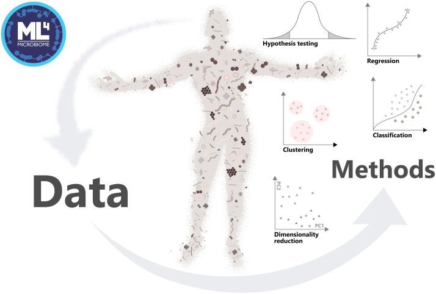
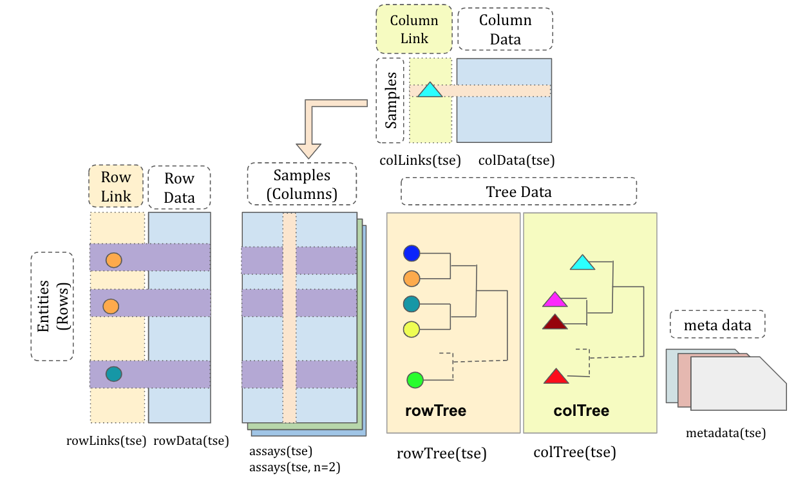
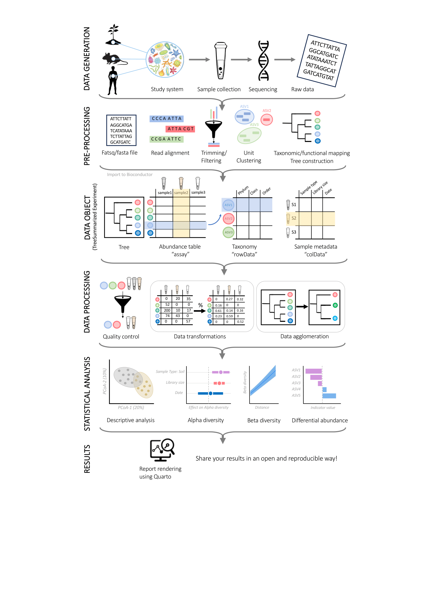
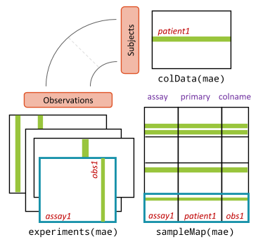
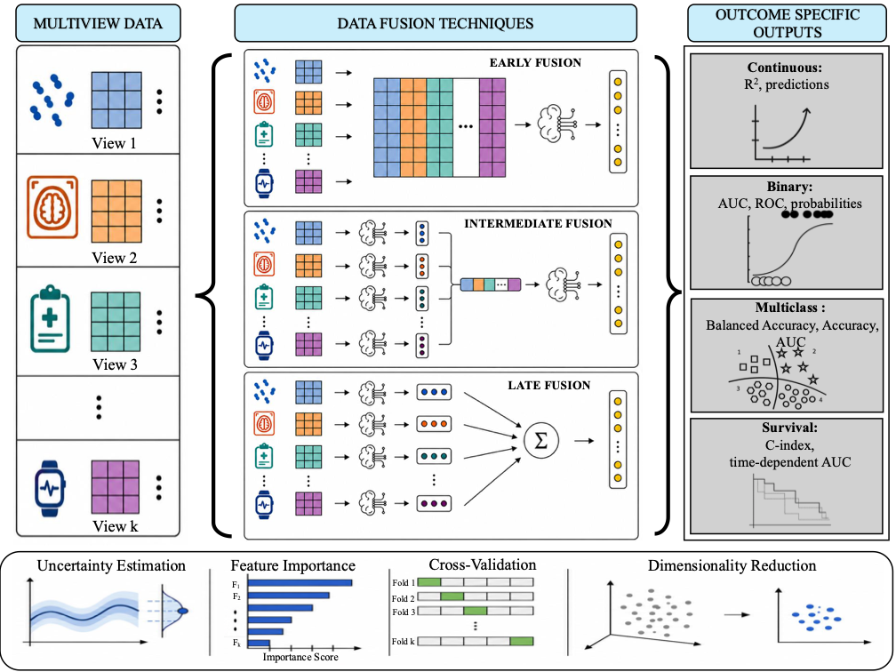

## Orchestrating Hologenomic Analysis with Bioconductor

{fig-alt="mia logo." fig-align="right" width=10%}

## Orchestrating Hologenomic Analysis with Bioconductor {auto-animate="true"}

- Introduces microbiome analysis framework, focusing multiomics methods
- For participants with sufficient programming skills

{fig-alt="mia logo." fig-align="right" width=10%}

::: {.notes}

:::

## Time outline {.smaller}

| Time        | Activity                                                     |
|-------------|--------------------------------------------------------------|
| 9:00-9:30   | Introduction to hologenomics                                 |
| 9:30-10:30  | Bioconductor's data science framework                        |
| 10:30-10:45 | Coffee break                                                 |
| 10:45-11:45 | Tabular data analysis for microbiomes                        |
| 11:45-12:45 | Incorporating hierarchical side information                  |
| 12:45-13:45 | Lunch                                                        |
| 13:45-14:30 | Programmatic access to hologenome data collections           |
| 14:30-15:15 | Multi-table data structures                                  |
| 15:15-15:30 | Coffee break                                                 |
| 15:30-17:00 | Methods for taxonomic, functional, and host omic integration |
| 17:00-17:30 | Q&A and closing session                                      |

::: {.notes}

:::

## Participation

- [An interactive tutorial](https://microbiome.github.io/ECCB2026OMA/)
- [Orchestrating Microbiome Analysis (OMA) online book](https://bioconductor.org/books/release/OMA/)
- [https://orchestraplatform.org/](https://orchestraplatform.org/)

::: {.notes}

:::

## Questions

- How is hologenome and multiomics data science conducted in the `r BiocStyle::Biocpkg("TreeSummarizedExperiment")` and `r BiocStyle::Biocpkg("MultiAssayExperiment")` ecosystem?

- What benefits does this integrated ecosystem have for analyzing multiple omics layers?

::: {.notes}

:::

## Objectives

- **Analyze and apply methods**: Apply the `r BiocStyle::Biocpkg("TreeSummarizedExperiment")` and `r BiocStyle::Biocpkg("MultiAssayExperiment")` ecosystem to process, integrate, and analyze hologenome and multiomics data.

- **Create visualizations**: Generate and interpret visualizations for multiomics data.

- **Explore documentation**: Use the [OMA](https://microbiome.github.io/OMA/docs/devel) to explore additional tools and methods for hologenome analysis.

::: {.notes}

:::

# (9:00-9:30) Introduction to hologenomics



::: {.notes}

:::

## Hologenomics

- _Holobiont_ = Host + microbiome [@nyholmHoloOmicsIntegratedHostMicrobiota2020]
- Understanding the host often requires understanding its microbes.
- Hologenomic approaches integrate information across the host–microbiome system

{fig-align="right"}

::: {.notes}

:::

## Multi-omics

**Multi-omics = combining different types of molecular data**

```{r}
#| label: omics
#| fig-width: 18
library(ggplot2)

omics <- data.frame(
  x = c(1, 3.5, 6, 8.5),
  label = c(
    "Metagenomics",
    "Metatranscriptomics",
    "Proteomics",
    "Metabolomics"
  )
)

ggplot() +
  # Boxes
  geom_label(
    data = omics,
    aes(x = x, y = 1, label = label),
    size = 5,
    label.size = 0.8,
    label.padding = unit(0.7, "lines"),
    fill = "white",
    fontface = "plain"
  ) +

  # Arrows
  annotate(
    "segment",
    x = 1.75, xend = 2.75,
    y = 1, yend = 1,
    arrow = arrow(length = unit(0.25, "cm"), type = "closed"),
    linewidth = 0.8
  ) +
  annotate(
    "segment",
    x = 4.25, xend = 5.25,
    y = 1, yend = 1,
    arrow = arrow(length = unit(0.25, "cm"), type = "closed"),
    linewidth = 0.8
  ) +
  annotate(
    "segment",
    x = 6.75, xend = 7.75,
    y = 1, yend = 1,
    arrow = arrow(length = unit(0.25, "cm"), type = "closed"),
    linewidth = 0.8
  ) +

  coord_cartesian(
    xlim = c(0, 10),
    ylim = c(0.2, 1.8)
  ) +

  theme_void()
```


::: {.notes}

:::


## Multi-omics integration

There are different ways to combine omics data:

- **Analyse separately:** Each omics layer independently

- **Find associations:** Identify relationships between omics layers

- **Jointly model:** Combine omics layers to explain outcomes or mechanisms

## Why Bioconductor?

Bioconductor provides tools for:

- Data handling
- Analysis
- Visualization
- Integration
- Reproducible workflows

{fig-alt="Bioconductor logo." fig-align="right" width="10%"}

::: {.notes}

:::

# (9:30-10:30) Bioconductor's data science framework

## Bioconductor

-   Community-driven, global open-source project
-   Started in 2001 from genomics
-   High impact across bioinformatics

{fig-alt="Bioconductor logo." fig-align="right" width="10%"}

::: notes
Project for developing software in bioinformatics.

Over 1.5 million distinct IPs per year are downloading.
:::

## Community is the key

-   Training programs & workshops
-   Community support
-   Conferences

{width="327"}

::: notes
1.  Bioconductor is more than software.
2.  Worldwide community of bioinformaticians; both users and developers.
:::

## Software

-   \~2,300 R packages
-   Review, testing, documentation

```{r}
#| label: bioc_packages
#| eval: true

# Get packages and info based on their BiocViews
pkgs <- BiocPkgTools::biocPkgList()
#
pkgs[["SE"]] <- sapply(pkgs$Depends, function(x) any(grepl("summarizedexperiment", x, ignore.case = TRUE)) )
fields <- sapply(pkgs$biocViews, function(x){
    field <- "Other"
    if( any(grepl("genomic|genetic|gene|genom|DNA", x, ignore.case = TRUE)) ){
        field <- "Genomics"
    }
    if( any(grepl("proteomics|protein", x, ignore.case = TRUE)) ){
        field <- "Proteomics"
    }
    if( any(grepl("metabolomics|metabolome|metabolite|Lipidom|massspectro", x, ignore.case = TRUE)) ){
        field <- "Metabolomics"
    }
    if( any(grepl("transcripto|RNA-seq|RNA", x, ignore.case = TRUE)) ){
        field <- "Transcriptomics"
    }
    if( any(grepl("immuno", x, ignore.case = TRUE)) ){
        field <- "Immunology"
    }
    if( any(grepl("cytom", x, ignore.case = TRUE)) ){
        field <- "Cytometrics"
    }
    if( any(grepl("microarray|chip", x, ignore.case = TRUE)) ){
        field <- "Microarray"
    }
    if( any(grepl("single-cell|singlecell", x, ignore.case = TRUE)) ){
        field <- "Single-cell"
    }
    if( any(grepl("metagenom|microbiome|16S|microbiota|amplicon|shotgun|microb|metatranscript|metametabolo|metaproteo", x, ignore.case = TRUE)) ){
        field <- "Microbiome"
    }
    return(field)
})
pkgs[["Field"]] <- fields
pkgs[pkgs[["Package"]] %in% c("mia", "miaViz", "miaSim", "iSEEtree", "HoloFoodR", "MGnifyR"), "Field"] <- "Microbiome"
# Get download stats 
df <- BiocPkgTools::biocDownloadStats()
# Subset to include only packages which BiocView we have
df <- df[df$Package %in% pkgs$Package, ]
# submitted <- BiocPkgTools::firstInBioc(df)
# df <- df[df$Package %in% pkgs$Package, ] # Take into account only current packages
pkgs <- pkgs[, c("Package", "SE", "Field")]
# Get table that shows which package is available in each date
dates <- df$Date |> unique()
dates <- dates[ dates < lubridate::floor_date(Sys.time(), "month") ]
available <- lapply(dates, function(date){
    temp <- df[df[["Date"]] == date, ]
    temp <- temp[match(unique(df$Package), temp$Package), ]
    temp <- temp[["Nb_of_distinct_IPs"]] > 0 | temp[["Nb_of_downloads"]] > 0
    temp[is.na(temp)] <- FALSE
    temp <- as.numeric(temp)
    return(temp)
})
available <- do.call(cbind, available) |> as.data.frame()
rownames(available) <- unique(df$Package)
colnames(available) <- dates
#
ind <- pkgs[match(unique(df$Package), pkgs$Package), "Field"][[1]]
pkgs_date <- rowsum(available, group = ind)
# Put into long format
library(tidyverse)
pkgs_date <- pkgs_date %>%
    rownames_to_column("Field") %>%
    pivot_longer(
        cols = colnames(pkgs_date)[ !colnames(pkgs_date) %in% c("Field")], 
        names_to = "Date",
        values_to = "N"
    )
pkgs_date[["Date"]] <- as.Date(pkgs_date[["Date"]])

# Create a plot that shows number of package through date
p1 <- ggplot(pkgs_date, aes(x = Date, y = N, fill = Field)) +
    geom_area() + theme_classic() + scale_fill_brewer(palette = "Paired") +
    labs(x = "Year", y = "Number of packages") +
    scale_x_date(
        expand = c(0, 0),
        limits = c(min(pkgs_date[["Date"]]), Sys.Date())
    ) +
    scale_y_continuous(expand = c(0, 0)) +
    theme_classic(base_size = 18)
```

```{r}
#| label: number_of_users
#| fig-width: 15

library(BiocPkgTools)
library(ggplot2)
library(scales)
library(patchwork)

df <-biocDownloadStats()
df <- df[df$Package == "mia", ]

years <- firstInBioc(df)[["Year"]]:as.integer(format(Sys.Date(), "%Y"))

years <- 2009:as.integer(format(Sys.Date(), "%Y"))

base_url <- "https://bioconductor.org/packages/stats/bioc"
all_data <- list()

for (yr in years) {
    url <- sprintf("%s/bioc_%d_stats.tab", base_url, yr)
    # try downloading safely
    try({
        df <- read.delim(url)
        df$Year <- yr
        all_data[[as.character(yr)]] <- df
    }, silent=TRUE)
}

all_data <- do.call(rbind, all_data)
df <- all_data[all_data[["Month"]] == "all", ]

df[["date"]] <- as.Date(paste0(df[["Year"]], "-01-01"))

p2 <- ggplot(df, aes(x = date, y = Nb_of_distinct_IPs)) +
    geom_col(fill = "gray", colour = "black") +
    scale_y_continuous(
        labels = label_number(scale_cut = cut_si("")),
        expand = c(0, 0)
    ) +
    scale_x_date(
        expand = c(0, 0),
        limits = c(min(df[["date"]]), Sys.Date())
    ) +
    labs(
        x = NULL,
        y = "Number of downloads from distinct IPs",
    ) +
    theme_classic(base_size = 18) 

p1 + p2
```

::: notes
1.  Popularity has grown.
2.  Broad range of fields (microbiome is rather small, but steadily raising \~ 50 packages)
3.  Over 2,300 R packages
4.  Not limited to R, but R has been the main language. Activity in Python and Julia.
5.  Special abut Bioconductor is the rather strict requirements which ensure the high-quality.

Review process when submitting (novel, relevant, works as it should be, documentation is sufficient) Testing is done automatically (daily). Software must be accessible. --\> documentation must be good
:::

## Data containers

- The core of software
- Structured, standardized way to manage complex data
- Enables modular, efficient workflows

```{r}
#| label: data_container

# Load libraries
library(ggplot2)
library(ggforce)

# Adjusting the text positions for better alignment
ellipse_data <- data.frame(
    x = c(0, 0, 0),         # Centers of ellipses
    y = c(2, 1, 0),         # Centers of ellipses
    a = c(4, 3, 2),         # Widths of ellipses
    b = c(3, 2, 1),         # Heights of ellipses
    label = c("COMMUNITY", "METHODS", "DATA CONTAINER"),  # Labels for each ellipse
    label_y = c(4, 1.75, 0) # Adjusted vertical positions for labels
)

# Plot with adjusted labels
ggplot() +
    geom_ellipse(data = ellipse_data, 
                 aes(x0 = x, y0 = y, a = a, b = b, angle = 0),
                 color = "darkgreen", fill = "grey90", alpha = 0.7) +
    geom_text(data = ellipse_data, 
              aes(x = x, y = label_y, label = label), 
              size = 5, fontface = "bold") +
    coord_fixed() +
    theme_void()
```

::: {.notes}

The core of software is formed by data containers.

Structured way to present complex data. Interlinks tables and data types.

In biology, usually we have abundance table, sample metadata, taxonomy table, phylogeny, ...

Managing this complex data set becomes a burden and lead easily to errors.

:::

##

```{r}
#| label: pages_and_book

library(magick)

img1 <- image_read("images/pile_of_papers.webp")
img2 <- image_read("images/book.png")
arrow <- image_blank(width = 500, height = 1000, color = "none") %>%
  image_annotate("→", size = 200, gravity = "center", color = "black")

# Combine images with the arrow
final_image <- image_append(c(img1, arrow, img2), stack = FALSE)

# Display the final image
final_image
```

::: {.notes}

Imagine pile of paper sheets that are unordered. Then imagine a book that holds these same pages in structured way. Would you rather read 100 pages from pile of mess or from book?

:::

##

```{r}
#| label: data_and_data_container

library(magick)

img1 <- image_read("images/unorganized_data.webp")
img2 <- image_read("images/TreeSE.png")
img2 <- image_scale(img2, "125%")
arrow <- image_blank(width = 500, height = 1000, color = "none") |>
  image_annotate("→", size = 200, gravity = "center", color = "black")

# Combine images with the arrow
final_image <- image_append(c(img1, arrow, img2), stack = FALSE)

# Display the final image
final_image
```

::: {.notes}

The same idea goes with the data containers. Instead of managing tables separately you can put them to this data container.

:::

## Optimal container for microbiome data?

- **Multiple assays**: seamless interlinking
- **Hierarchical data**: supporting samples & features
- **Side information**: extended capabilities & data types
- **Optimized**: for speed & memory
- **Integrated**: with other applications & frameworks

::: {.notes}

Bioconductor aims to harmonize the data format so that the same format can be used through the ecosystem.

In biological data science, we apply similar techniques despite the field.

:::

## `r BiocStyle::Biocpkg("TreeSummarizedExperiment")`
<small>[@Huang2021]</small>

{fig-alt="TreeSummarizedExperiment class" fig-align="center" width=10%}

::: {.notes}

Extension to SummarizedExperiment

Tailored for biological data science.

Go thorugh every slot.

:::

## `r BiocStyle::Biocpkg("SummarizedExperiment")`
<small>[@Huber2015]</small>

```{r}
#| label: se_field
#| fig-align: "right"
#| eval: true


if( !require("BiocManager") ){
    install("BiocManager")
}
pkgs <- c("BiocPkgTools", "lubridate", "tidyverse")
temp <- sapply(pkgs, function(pkg){
    if( !require(pkg, character.only = TRUE) ){
        BiocManager::install(pkg)
        library(pkg, character.only = TRUE)
    }
})

# Get packages and info based on their BiocViews
pkgs <- biocPkgList()
#
pkgs[["SE"]] <- sapply(pkgs[["Depends"]], function(x) any(grepl("summarizedexperiment", x, ignore.case = TRUE)) )
pkgs <- pkgs[pkgs[["SE"]], ]
fields <- sapply(pkgs$biocViews, function(x){
    field <- "Other"
    if( any(grepl("genomic|genetic|gene|genom|DNA", x, ignore.case = TRUE)) ){
        field <- "Genomics"
    }
    if( any(grepl("proteomics|protein", x, ignore.case = TRUE)) ){
        field <- "Proteomics"
    }
    if( any(grepl("metabolomics|metabolome|metabolite|Lipidom|massspectro", x, ignore.case = TRUE)) ){
        field <- "Metabolomics"
    }
    if( any(grepl("transcripto|RNA-seq|RNA", x, ignore.case = TRUE)) ){
        field <- "Transcriptomics"
    }
    if( any(grepl("immuno", x, ignore.case = TRUE)) ){
        field <- "Immunology"
    }
    if( any(grepl("cytom", x, ignore.case = TRUE)) ){
        field <- "Cytometrics"
    }
    if( any(grepl("microarray|chip", x, ignore.case = TRUE)) ){
        field <- "Microarray"
    }
    if( any(grepl("single-cell|singlecell", x, ignore.case = TRUE)) ){
        field <- "Single-cell"
    }
    if( any(grepl("metagenom|microbiome|16S|microbiota|amplicon|shotgun|microb|metatranscript|metametabolo|metaproteo", x, ignore.case = TRUE)) ){
        field <- "Microbiome"
    }
    return(field)
})
pkgs[["Field"]] <- fields
pkgs[pkgs[["Package"]] %in% c("mia", "miaViz", "miaSim", "iSEEtree", "HoloFoodR", "MGnifyR"), "Field"] <- "Microbiome"
# Get download stats 
df <- biocDownloadStats()
# Subset to include only packages which BiocView we have
df <- df[df[["Package"]] %in% pkgs$Package, ]
# Add field info
df[["Field"]] <- pkgs[match(df[["Package"]], pkgs[["Package"]]), "Field"][[1]]
# df <- df[df$Package %in% pkgs$Package, ] # Take into account only current packages
pkgs <- pkgs[, c("Package", "SE", "Field")]
# Get table that shows which package is available in each date
dates <- df$Date |> unique()
dates <- dates[ dates < floor_date(Sys.time(), "month") ]
available <- lapply(dates, function(date){
    temp <- df[df[["Date"]] == date, ]
    temp <- temp[match(unique(df$Package), temp$Package), ]
    temp <- temp[["Nb_of_distinct_IPs"]] > 0 | temp[["Nb_of_downloads"]] > 0
    temp[is.na(temp)] <- FALSE
    temp <- as.numeric(temp)
    return(temp)
})
available <- do.call(cbind, available) |> as.data.frame()
rownames(available) <- unique(df[["Package"]])
colnames(available) <- dates
#
ind <- pkgs[match(unique(df[["Package"]]), pkgs[["Package"]]), "Field"][[1]]
pkgs_date <- rowsum(available, group = ind)
# Put into long format
pkgs_date <- pkgs_date |>
    rownames_to_column("Field") |>
    pivot_longer(
        cols = colnames(pkgs_date)[ !colnames(pkgs_date) %in% c("Field")], 
        names_to = "Date",
        values_to = "N"
    )
pkgs_date[["Date"]] <- pkgs_date[["Date"]] |> as.Date()

# Create a plot that shows number of package through date
p <- ggplot(pkgs_date, aes(x = Date, y = N, fill = Field)) +
    geom_area() +
    theme_classic(base_size = 18) +
    scale_fill_brewer(palette = "Paired") +
    labs(x = "Year", y = "Number of packages") +
    scale_y_continuous(expand = c(0, 0), limits = c(0, NA))
p
```

::: {.notes}

The same data container is used in different fields. So to analyse multi-omics data, you need to know only one data container.

:::

## Data import

##

{fig-alt="Microbiome data science workflow" fig-align="center" width=40%}

##

{style="width:140%; height:650px; object-fit:cover; object-position:top;" fig-alt="Microbiome data science workflow" fig-align="center"}

##

{style="width:120%; height:800px; object-fit:cover; object-position:bottom;"}

::: {.notes}

mia is for downstream analysis

:::

## Importers and converters

- `mia` includes importers and converters for standard data formats
  - Importer: Import file
  - Converter: Convert R object to other format
- You can also create `TreeSE` object manually

::: {.notes}

Importers and converters for standard data formats.

You can also create TreeSE object manually by hand if you have csv or excel files.

:::

# (10:45-12:45) Tabular data analysis for microbiomes & incorporating hierarchical side information


## Microbiome Analysis (`r BiocStyle::Biocpkg("mia")`)

```{r}
#| label: mia_stats
#| eval: true

library(BiocPkgTools)

perc <- pkgDownloadRank("mia")
perc <- paste0(perc, "%")

df <-biocDownloadStats()
df <- df[df$Package == "mia", ]

years <- firstInBioc(df)[["Year"]]:as.integer(format(Sys.Date(), "%Y"))

base_url <- "https://bioconductor.org/packages/stats/bioc/mia"
all_data <- list()

for (yr in years) {
    url <- sprintf("%s/mia_%d_stats.tab", base_url, yr)
    # try downloading safely
    try({
        df <- read.delim(url)
        df$Year <- yr
        all_data[[as.character(yr)]] <- df
    }, silent=TRUE)
}

all_data <- do.call(rbind, all_data)
df <- all_data[all_data[["Month"]] == "all", ]

last_year <- sort(df[["Year"]])[ which(sort(df[["Year"]]) == as.integer(format(Sys.Date(), "%Y")))-1 ]

num_downloads <- df[df[["Year"]] == last_year, "Nb_of_distinct_IPs"]
num_downloads <- floor(num_downloads / 1000) * 1000

num_downloads <- paste0(format(num_downloads, big.mark = ","))
```

-   Microbiome data science ecosystem
-   "Downstream", statistical analysis
-   \> `r if(exists("num_downloads")) num_downloads else "*ERROR*"` yearly downloads from distinct IPs (top `r if(exists("perc")) perc else "*ERROR*"` in Bioconductor)

::: {style="text-align: right;"}
 
:::

::: notes
1.  Within Bioconductor, we have developed microbiome data science ecosystem
2.  For downstream analysis
3.  Aligned and tightly linked with broader Bioconductor ecosystem
:::

## Community-driven ecosystem of tools {.smaller}

::::: columns
::: {.column width="70%"}
-   `r BiocStyle::Biocpkg("mia")` (Data analysis)
-   `r BiocStyle::Biocpkg("miaViz")` (Visualization)
-   `r BiocStyle::Biocpkg("miaSim")` (Simulation)
-   [miaTime](https://github.com/microbiome/miaTime) (Time series analysis)
-   `r BiocStyle::Biocpkg("miaDash")` (Graphical user interface)
-   `r BiocStyle::Biocpkg("iSEETree")` (Interactive visualization)
-   [Expanded by independent developers](https://microbiome.github.io/OMA/docs/devel/pages/miaverse.html#sec-packages)
:::

::: {.column width="30%"}
{fig-alt="mia logo." width="20%"} {fig-alt="MGnifyR logo." width="20%"} {fig-alt="HoloFoodR logo." width="20%"} {fig-alt="iSEE logo." width="20%"} {fig-alt="MAE logo." width="20%"} {fig-alt="SE logo." width="20%"} {fig-alt="SCE logo." width="20%"} {fig-alt="scater logo." width="20%"} {fig-alt="benchdamic logo." width="20%"} {fig-alt="netcomi logo." width="20%"} {fig-alt="radEmu logo." width="20%"} {fig-alt="DESeq2 logo." width="20%"} {fig-alt="Biobakery logo." width="20%"} {fig-alt="anansi logo." width="20%"}
:::
:::::

::: notes
Ecosystem of packages developed by the community. mia provides the basic operations in microbiome data analysis. miaViz has the methods for visualization.

Developed by independent developers who have started to support the ecosystem.
:::

## Orchestrating Microbiome Analysis with Bioconductor

-   Resources and tutorials for microbiome analysis
-   Community-built best practices
-   Open to contributions!

::: callout-tip
## Go to the Orchestrating Microbiome Analysis (OMA) online book

[microbiome.github.io/OMA](https://microbiome.github.io/OMA/docs/devel/){preview-link="true"}
:::

::: notes
To support users and to collect best practices, there is online book available.
:::

# (13:45-14:30) Programmatic access to hologenome data collections

## Several resources provide microbiome multi-omics data

- `r BiocStyle::Biocpkg("HoloFoodR")`
- `r BiocStyle::Biocpkg("curatedMetagenomicData")` (only metagenomics)
- [microbiome-metabolome-curated-data repository](https://github.com/borenstein-lab/microbiome-metabolome-curated-data/tree/main)
- HuMMANet [@Verma2026]

# (14:30-15:15) Multi-table data structures

## `r BiocStyle::Biocpkg("MultiAssayExperiment")`
<small>[@ramos2017]</small>

- For more complex sample mapping

{fig-alt="TreeSummarizedExperiment class" fig-align="center" width=10%}

::: {.notes}

TreeSE already supports linking multiple experiments, but this allows more flexibility.

TreeSE requires 1-to-1 mapping, but usually samples might be missing from some experiments.

:::

# (15:30-17:00) Methods for taxonomic, functional, and host omic integration

##

_A systematic benchmark of integrative strategies for microbiome-metabolome data_ [@mangnier2025]

```{r table-methods, echo=FALSE}
library(knitr)

methods_table <- data.frame(
  `Aim` = c(
    "Global associations",
    "Data summarization",
    "Individual associations",
    "Feature selection"
  ),
  `Method` = c(
    "Mantel",
    "RDA",
    "MiRKAT",
    "CODA-LASSO"
  )
)

kable(
  methods_table,
  align = c("l", "l", "l"),
  caption = "Multi-omics statistical approaches"
)
```

## Mantel test

**Question:** Are two omics datasets related?

- Compares **distance matrices**
- Tests for a **global association** between omics layers

::: notes
The Mantel test asks whether samples that are similar in one omics dataset
are also similar in another.
:::

## Microbiome Regression-based Kernel Association Test (MiRKAT)

**Question:** Is a pathway associated with the global microbiome profile?

- Represents microbiome **similarity between samples**
- Tests its association with a **pathway**

::: notes
MiRKAT uses a kernel to represent similarity between microbiome profiles.
It therefore tests the microbiome at a global level rather than testing
individual taxa.
:::

## Pairwise association

**Question:** Which features are associated?

- Tests **feature–feature associations**
- Can reveal candidate biological interactions

::: notes
Rather than asking whether the two datasets are globally related,
pairwise methods identify specific associations between features.

Limitation: pairwise associations consider features individually and
do not account for the role of microbes within the broader microbial
network.
:::

## Joint robust principal component analysis (joint RPCA) [@CordazzoVargas2026]

**Question:** What are the main shared patterns?

1. **Denoise:** learn a lower-dimensional representation (samples × dimensions)
2. **PCA:** find components that **capture maximum variance**
3. **Visualize:** samples in **PCA space** and identify the **loadings driving the variation**

::: notes
Joint RPCA first denoises each data layer by approximating it in a lower
dimensional space, allowing layer-specific weights. The resulting
representations are then combined and PCA is applied to obtain a shared
low-dimensional space. A scatter plot can then be used to visualize how
samples relate across the integrated omics data.
:::

## Integrated machine learning for multi-omics prediction and classification [@mallick2024]


## Multi-omics data fusion {.smaller}

:::: {.columns}

::: {.column width="45%"}
{style="width:100%; height:650px; object-fit:cover; object-position:bottom;"}
:::

::: {.column width="55%"}

- **Early fusion:** Concatenate the different data tables into a single table and train one machine-learning model on the combined features.

- **Intermediate fusion:** Train separate models for each omics layer and then use a meta-model to combine the information or predictions from these models. This approach can often capture complementary information more flexibly than simple early or late fusion.

- **Late fusion:** Train a separate model for each omics layer and combine their predictions, for example by averaging or weighting them.

:::

::::

::: notes

:::

# (17:00-17:30) Q&A and closing session

## Other approaches

- **Anansi** tests biologically informed pairwise associations [@bastiaanssen2023].

- **Multi-Omics Factor Analysis (MOFA)** finds shared and layer-specific latent factors [@argelaguet2020].

- **DIABLO**, implemented in mixOmics, identifies multi-omics features that discriminate groups [@rohart2017].

::: notes

:::

## Thank you for your time!

**Join us!**

- OMA book: [bioconductor.org/books/release/OMA/](https://bioconductor.org/books/release/OMA/)

- Discussion forums: Bioconductor Zulip

- Microbiome working group

{fig-alt="mia logo" fig-align="right"}

## References
