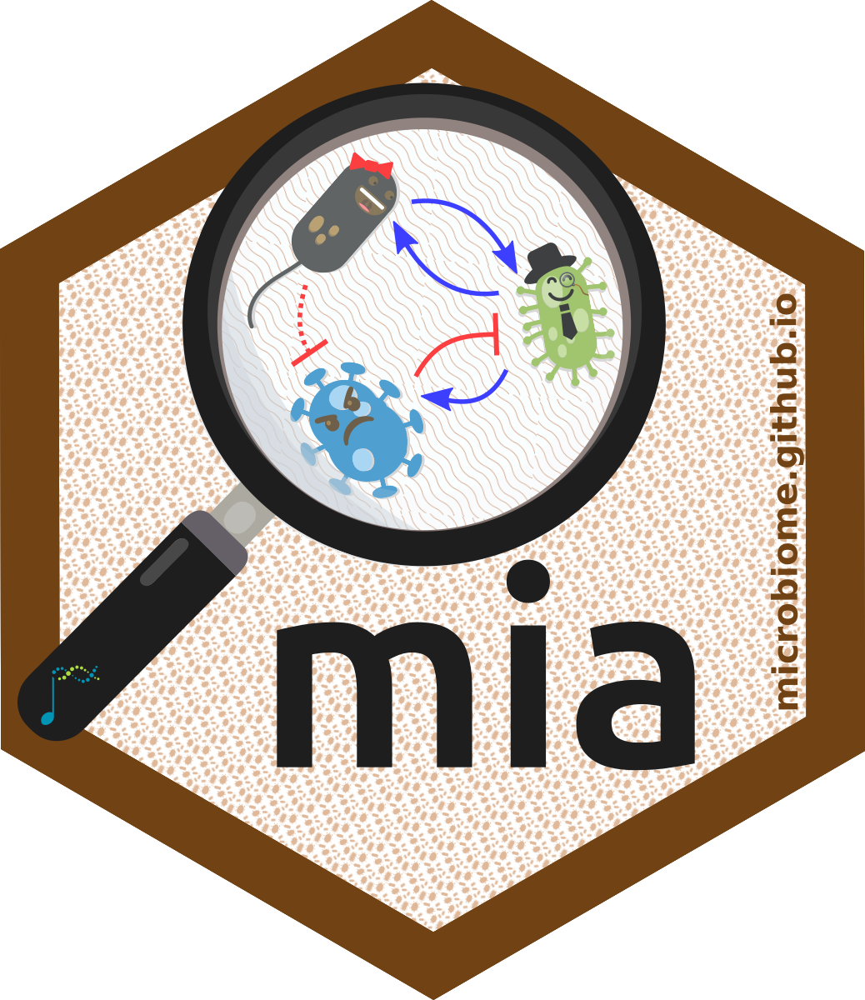
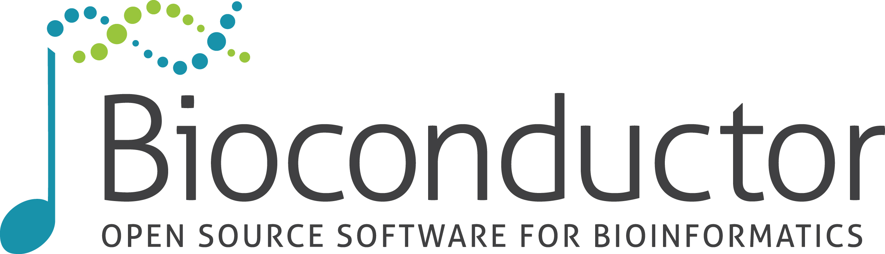
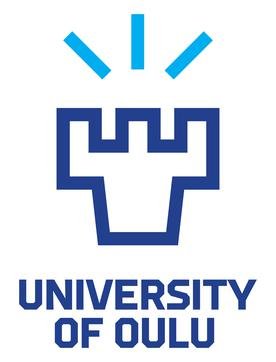
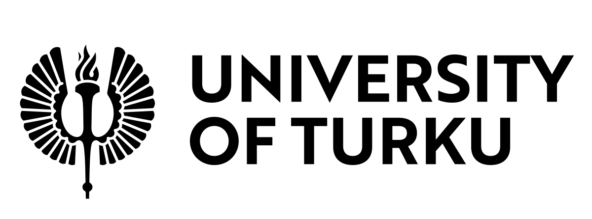
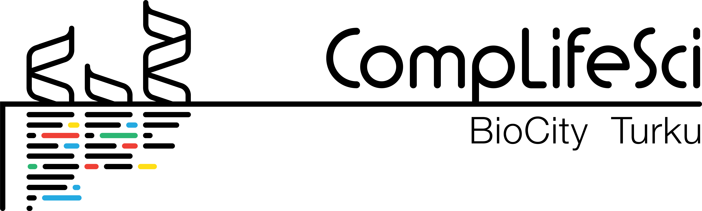
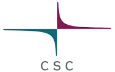
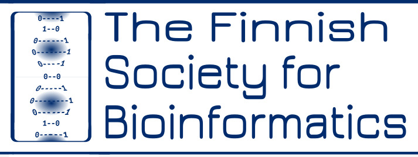
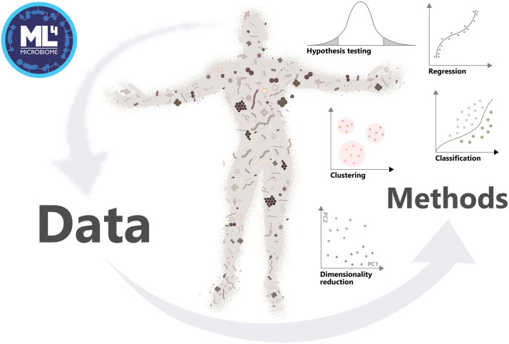

## Microbiome data science and multi-omics with R/Bioconductor

**University of Oulu**, **Sep 28–30, 2026 (Mon–Wed)**  
Daily: ~**9:00–16:00** (lectures + demos + hands-on)

::: {.center}

::: columns
::: column{width="50%"}
{fig-alt="mia logo" width=10%}
{fig-alt="Bioconductor logo" width=35%}
{fig-alt="University of Oulu logo" width=10%}
{fig-alt="UTU logo" width=30%}
:::
:::
  
::: columns
::: column{width="50%"}
{fig-alt="CompLifeSci logo" width=25%}
{fig-alt="CSC logo" width=15%}
{fig-alt="Bioinformatics society logo" width=20%}
:::
:::

:::

## Code of Conduct

Bioconductor community values:

- sharing of ideas, code, software, and expertise
- collaboration
- diversity and inclusivity
- a kind and welcoming environment

Full CoC: <https://bioconductor.github.io/bioc_coc_multilingual/>

## Course overview

The course provides a gentle introduction to **microbiome and multi-omic data science**
with **R/Bioconductor**, focusing on:

- reproducible data analysis workflows
- standardized data containers for biomedical data integration
- how to approach new analysis tasks using documentation + existing tools

::: notes
Emphasize: you don't need to know everything—learn the ecosystem and how to navigate.
:::

## Instructors and organizers

**Instructors:** Leo Lahti, Tuomas Borman  
**Coordinator:** Anna Kaisanlahti  
**Organizers:** HBS-DP (University of Oulu Graduate School) 
**Computing support:** CSC (cloud services)

## Target audience

For MSc students, PhD candidates, postdocs, and researchers who want to build skills in:

- statistical programming in R
- omics data analysis and visualization
- reproducible reporting

::: notes

:::

## Learning goals

After the course, you will be able to:

- use **Bioconductor** data infrastructure for omics data analysis
- work with standardized containers for **single-omics** and **multi-omics**
- build **reproducible workflows** with Quarto
- continue learning independently using the OMA documentation

## Materials & links

- OMA book: <https://bioconductor.org/books/release/OMA/>
- CSC environment: <https://noppe.rahtiapp.fi/>
- Google docs for questions <https://shorturl.at/mePkH>

## Practicalities

- Each topic: **short lecture + demonstration**
- Majority of time: **hands-on exercises**
- Help available during exercises
- Materials remain available after the course

## Schedule overview

**Day 1:** Reproducible workflows with R/Bioconductor and Quarto  
**Day 2:** Tabular data analysis (working with single 'omics)  
**Day 3:** Multi-assay data integration (multi-omics methods)

# Day 1 — Open data science

## Day 1 — Open data science {.smaller}

| Time | Activity |
|-------------|----------|
| 9:00–10:00  | Coffee, welcome & practicalities |
| 10:00–11:00 | Introduction to CSC RStudio notebook |
| 11:00–12:00 | Lecture: open & reproducible workflows |
| 12:00–13:00 | Lunch break |
| 13:00–16:00 | Working with data containers and workflows |
| Evening     | Informal course dinner (own cost) |

## Learning goals

- Understand principles of open & reproducible microbiome/omics analysis
- Become familiar with the Bioconductor ecosystem
- Learn the role of standardized data containers for omics data

## Microbiome research

- Microbiome: community of microbes and their genes in certain habitat (e.g., human gut)
- Vital role
- Data typically sequencing profiles, along with additional molecular layers

{fig-align="right"}

::: notes
Tämä dia voi mennä muualle, mutta jos muistan oikein, olemme olettaneet edellisillä kursseilla, että ihmiset tietää, mikä on mikrobiomi. Se kannattaa käydä nopeasti alussa läpi.
:::

## Slides

- [Data containers](https://microbiome.github.io/outreach/data_containers.html){target="_blank"}
- [Import](https://microbiome.github.io/outreach/import.html){target="_blank"}

## Exercises

- [Chapter 4, Exercises 1.2-1.7](https://bioconductor.org/books/release/OMA/pages/import.html)
- [Chapter 11, all exercises](https://bioconductor.org/books/release/OMA/pages/transformation.html)
- [Chapter 10, all exercises](https://bioconductor.org/books/release/OMA/pages/agglomeration.html)

<!--
- [Chapter 8, all exercises](https://bioconductor.org/books/release/OMA/pages/quality_control.html)

- [Chapter 12, all exercises](https://bioconductor.org/books/release/OMA/pages/composition.html)
-->

## Day 1 — Wrap-up

- **Reproducible & transparent reporting**: makes analyses verifiable and easier to reuse, review, and extend (for you and others)
- `TreeSummarizedExperiment`: standard container for microbiome data
- **Bioconductor** provides interoperable packages built on shared data infrastructure

::: notes

:::

## Feedback

```{r}
#| label: feedback_qr
#| fig-cap: "https://forms.gle/iEkoNdMVp9BUnyqNA"
qrcode::qr_code("https://forms.gle/iEkoNdMVp9BUnyqNA") |> plot()
```


# Day 2 — Tabular data analysis

## Day 2 — Tabular data analysis {.smaller}

| Time | Activity |
|-------------|----------|
| 9:00–10:00  | Lecture: analysis & visualization of tabular data (single omics) |
| 10:00–12:00 | Subsetting, transformations, and data summaries |
| 12:00–13:00 | Lunch break |
| 13:00–14:00 | Univariate data analysis and visualization |
| 14:00–16:00 | Multivariate data analysis and visualization |

## Learning goals

Calculate, visualize, and interpret

- alpha diversity
- beta diversity
- differential abundance/prevalence

## Slides

- [Alpha diversity](https://microbiome.github.io/outreach/alpha_diversity.html){target="_blank"}
- [Beta diversity ordination](https://microbiome.github.io/outreach/ordination.html){target="_blank"}
- [Differential abundance analysis](https://microbiome.github.io/outreach/daa.html){target="_blank"}

## Exercises

- [Chapter 13, all exercises](https://bioconductor.org/books/release/OMA/pages/alpha_diversity.html)

<!--
- [Chapter 14, Exercises 1.2-1.8, 3.1-3.6 exercises](https://bioconductor.org/books/release/OMA/pages/community_similarity.html)
- [Chapter 14, all exercises](https://bioconductor.org/books/release/OMA/pages/community_similarity.html)
- [Chapter 16, all exercises](https://bioconductor.org/books/release/OMA/pages/differential_abundance.html)

-->

## Day 2 — Wrap-up

- Alpha diversity: `mia::addAlpha()` + `miaViz::plotBoxplot()`
- Beta diversity ordination: `mia::addMDS()`/`mia::addRDA()` + `miaViz::plotOrdination()`/`miaViz::plotRDA()`
- Differential abundance analysis: `maaslin3::maaslin3()`

## Feedback

```{r}
#| label: feedback_qr2
#| fig-cap: "https://forms.gle/iEkoNdMVp9BUnyqNA"
qrcode::qr_code("https://forms.gle/iEkoNdMVp9BUnyqNA") |> plot()
```

# Day 3 — Multi-assay data integration

## Day 3 — Multi-assay data integration {.smaller}

| Time | Activity |
|-------------|----------|
| 9:00–10:00  | Lecture: analysis & visualization of multi-assay data (multi-omics) |
| 10:00–12:00 | Multi-assay data analysis and visualization |
| 12:00–13:00 | Lunch break |
| 13:00–15:00 | Q&A and advanced techniques (time series, machine learning, simulation) |
| 15:00–16:00 | Summary and wrap-up |

## Learning goals

- Goals for the day

## Summary

- x
- x
- x

## Feedback

```{r}
#| label: feedback_qr3
#| fig-cap: "https://forms.gle/iEkoNdMVp9BUnyqNA"
qrcode::qr_code("https://forms.gle/iEkoNdMVp9BUnyqNA") |> plot()
```

## Acknowledgements

::: {.center}

::: columns
::: column{width="50%"}
{fig-alt="mia logo" width=10%}
{fig-alt="Bioconductor logo" width=35%}
:::
:::
  
::: columns
::: column{width="50%"}
{fig-alt="University of Oulu logo" width=10%}
{fig-alt="UTU logo" width=30%}
{fig-alt="CompLifeSci logo" width=25%}
:::
:::
  
::: columns
::: column{width="50%"}
{fig-alt="CSC logo" width=15%}
{fig-alt="Bioinformatics society logo" width=20%}
:::
:::

:::

## References
