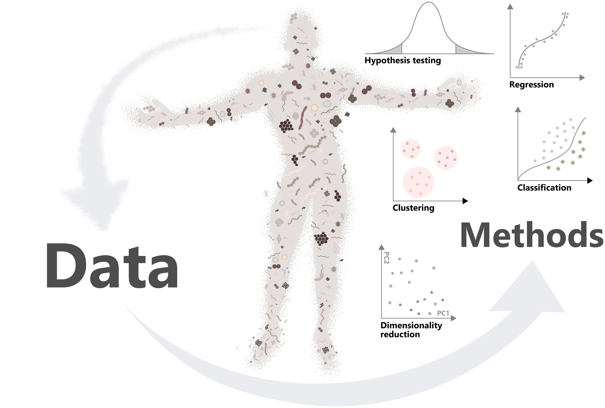
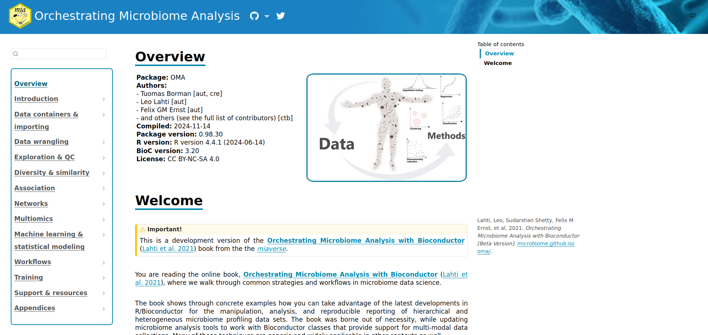
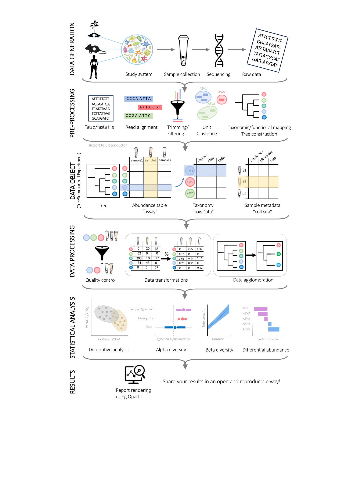
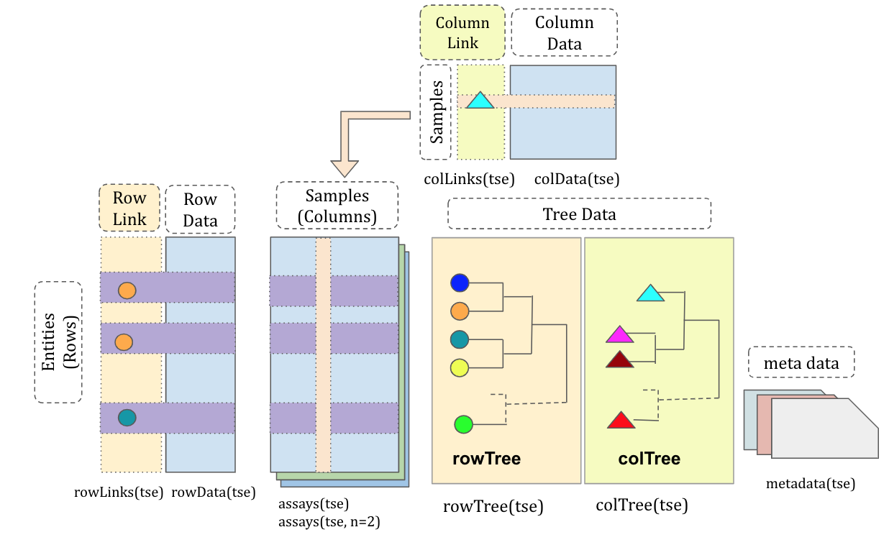
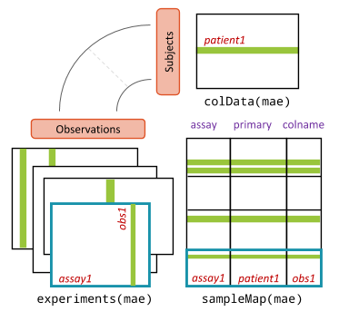

## {.title-hero background-color="#0b2545" background-image="images/oma.png" background-opacity="0.18" background-size="cover"}

::: kicker
University of Oulu · Sep 28–30, 2026
:::

::: big
From microbes<br>to multi-omics
:::

::: meta
Microbiome data science with **R/Bioconductor**<br>
Three days · 9:00–16:00 · lectures, demos & hands-on<br><br>
**Leo Lahti** · **Tuomas Borman** · **Anna Kaisanlahti**
:::

::: {.logo-strip .on-dark}
{fig-alt="mia logo"}
{fig-alt="Bioconductor logo"}
{fig-alt="University of Oulu logo"}
{fig-alt="UTU logo"}
{fig-alt="CompLifeSci logo"}
{fig-alt="CSC logo"}
{fig-alt="Bioinformatics society logo"}
:::

## Why are we here?

{fig-alt="Data and methods cycle" fig-align="center" width="80%"}

::: notes
Microbiome = community of microbes and their genes in a given habitat.
The course is about closing the loop between data and methods.
:::

## What you will learn

::: cards
::: {.card .teal}
[🔁]{.icon}

[Reproducible]{.card-title}

Transparent workflows with R and Quarto
:::

::: {.card .coral}
[📦]{.icon}

[Standardized]{.card-title}

Shared data containers for single- and multi-omics
:::

::: {.card .gold}
[🧭]{.icon}

[Independent]{.card-title}

Navigate documentation & existing tools for new tasks
:::
:::

::: statement
You don't need to know everything —<br>learn the ecosystem and how to navigate it.
:::

## Three days at a glance

::: cards
::: {.card .teal}
[Day 1]{.pill}

[Open data science]{.card-title}

Reproducible workflows with R/Bioconductor and Quarto
:::

::: {.card .coral}
[Day 2]{.pill .coral}

[Single omics]{.card-title}

Tabular data analysis & visualization
:::

::: {.card .navy}
[Day 3]{.pill .navy}

[Multi-omics]{.card-title}

Multi-assay data integration
:::
:::

<br>

Each topic: **short lecture + demo**, then mostly **hands-on exercises** — help is always available and materials stay online after the course.

## Who's who

::: cards
::: {.card .teal}
[Instructors]{.card-title}

Leo Lahti<br>Tuomas Borman
:::

::: {.card .coral}
[Coordinator]{.card-title}

Anna Kaisanlahti
:::

::: {.card .gold}
[Organizers]{.card-title}

HBS-DP, University of Oulu Graduate School
:::

::: {.card .navy}
[Computing]{.card-title}

CSC cloud services
:::
:::

<br>

**For:** MSc students, PhD candidates, postdocs and researchers building skills in
[R programming]{.pill} [omics analysis]{.pill .coral} [visualization]{.pill .gold} [reproducible reporting]{.pill .navy}

## Materials & links

::: columns
::: {.column width="55%"}
📘 **OMA book**<br><https://bioconductor.org/books/release/OMA/>

☁️ **CSC environment**<br><https://noppe.rahtiapp.fi/>

💬 **Questions**<br>shared Google doc
:::

::: {.column width="45%"}
{fig-alt="OMA book screenshot"}
:::
:::

## Code of Conduct

::: cards
::: {.card .teal}
[🤝]{.icon}

Sharing ideas, code, software and expertise
:::

::: {.card .coral}
[🧩]{.icon}

Collaboration
:::

::: {.card .gold}
[🌍]{.icon}

Diversity and inclusivity
:::

::: {.card .navy}
[💛]{.icon}

A kind and welcoming environment
:::
:::

<br>

Bioconductor CoC: <https://bioconductor.github.io/bioc_coc_multilingual/>

## {.day-divider background-color="#13a89e"}

::: day-num
01
:::

[Open data science]{.day-title}

Reproducible workflows with R/Bioconductor and Quarto

## Day 1 — Schedule {.smaller}

| Time        | Activity                                   |
|-------------|--------------------------------------------|
| 9:00–10:00  | ☕ Coffee, welcome & practicalities        |
| 10:00–11:00 | Introduction to CSC RStudio notebook       |
| 11:00–12:00 | Lecture: open & reproducible workflows     |
| 12:00–13:00 | 🍽️ Lunch break                             |
| 13:00–16:00 | Working with data containers and workflows |
| Evening     | Informal course dinner (own cost)          |

## Day 1 — Goals

::: columns
::: {.column width="50%"}
- Principles of **open & reproducible** microbiome / omics analysis
- The **Bioconductor** ecosystem
- Why **standardized data containers** matter
:::

::: {.column width="50%"}
{fig-alt="Microbiome analysis workflow" height="560px"}
:::
:::

## Microbiome research

::: columns
::: {.column width="50%"}
- **Microbiome:** the community of microbes and their genes in a habitat (e.g. human gut)
- Vital role in health & environment
- Data: sequencing profiles + additional molecular layers
:::

::: {.column width="50%"}
{fig-alt="Microbiome illustration"}
:::
:::

::: notes
Käy nopeasti läpi mikä on mikrobiomi — aiemmilla kursseilla olemme olettaneet, että osallistujat tietävät.
:::

## One container to hold it all

{fig-alt="TreeSummarizedExperiment structure" fig-align="center" width="85%"}

::: {.center}
`TreeSummarizedExperiment` — assays, sample & feature data, trees in one object
:::

## Hands-on

::: cards
::: {.card .teal}
[🖥️ Slides]{.card-title}

[Data containers](https://microbiome.github.io/outreach/data_containers.html){target="_blank"}
:::

::: {.card .coral}
[✍️ Exercises]{.card-title}

[OMA Chapter 4, Exercises 1.2–1.7](https://bioconductor.org/books/release/OMA/pages/import.html)
:::
:::

<!--
- [Chapter 8, all exercises](https://bioconductor.org/books/release/OMA/pages/quality_control.html)
- [Chapter 10, all exercises](https://bioconductor.org/books/release/OMA/pages/agglomeration.html)
- [Chapter 11, all exercises](https://bioconductor.org/books/release/OMA/pages/transformation.html)
- [Chapter 12, all exercises](https://bioconductor.org/books/release/OMA/pages/composition.html)
-->

## Day 1 — Take-home

::: cards
::: {.card .teal}
[Reproducible reporting]{.card-title}

Analyses become verifiable and easier to reuse, review and extend
:::

::: {.card .coral}
[TreeSE]{.card-title}

`TreeSummarizedExperiment` is the standard container for microbiome data
:::

::: {.card .navy}
[Bioconductor]{.card-title}

Interoperable packages built on shared data infrastructure
:::
:::

## Feedback · Day 1 {background-color="#f6f4ef"}

::: columns
::: {.column width="50%"}
```{r}
#| label: feedback_qr
#| echo: false
qrcode::qr_code("https://forms.gle/iEkoNdMVp9BUnyqNA") |> plot()
```
:::

::: {.column width="50%"}
::: statement
Tell us what worked — and what didn't.
:::

<https://forms.gle/iEkoNdMVp9BUnyqNA>
:::
:::

## {.day-divider background-color="#f26b5b"}

::: day-num
02
:::

[Single omics]{.day-title}

Tabular data analysis & visualization

## Day 2 — Schedule {.smaller}

| Time        | Activity                                                         |
|-------------|------------------------------------------------------------------|
| 9:00–10:00  | Lecture: analysis & visualization of tabular data (single omics) |
| 10:00–12:00 | Subsetting, transformations, and data summaries                  |
| 12:00–13:00 | 🍽️ Lunch break                                                   |
| 13:00–14:00 | Univariate data analysis and visualization                       |
| 14:00–16:00 | Multivariate data analysis and visualization                     |

## Day 2 — Goals

- Goals for the day

## Day 2 — Take-home

- x
- x
- x

## Feedback · Day 2 {background-color="#f6f4ef"}

::: columns
::: {.column width="50%"}
```{r}
#| label: feedback_qr2
#| echo: false
qrcode::qr_code("https://forms.gle/iEkoNdMVp9BUnyqNA") |> plot()
```
:::

::: {.column width="50%"}
::: statement
Tell us what worked — and what didn't.
:::

<https://forms.gle/iEkoNdMVp9BUnyqNA>
:::
:::

## {.day-divider background-color="#0b2545"}

::: day-num
03
:::

[Multi-omics]{.day-title}

Multi-assay data integration

## Day 3 — Schedule {.smaller}

| Time        | Activity                                                                |
|-------------|-------------------------------------------------------------------------|
| 9:00–10:00  | Lecture: analysis & visualization of multi-assay data (multi-omics)     |
| 10:00–12:00 | Multi-assay data analysis and visualization                             |
| 12:00–13:00 | 🍽️ Lunch break                                                          |
| 13:00–15:00 | Q&A and advanced techniques (time series, machine learning, simulation) |
| 15:00–16:00 | Summary and wrap-up                                                     |

## Linking the layers

::: columns
::: {.column width="45%"}
{fig-alt="MultiAssayExperiment structure"}
:::

::: {.column width="55%"}
`MultiAssayExperiment` links several omics layers measured on the same subjects.

<br>

[microbiome]{.pill} [metabolome]{.pill .coral} [transcriptome]{.pill .gold} [clinical]{.pill .navy}
:::
:::

## Day 3 — Goals

- Goals for the day

## Summary

- x
- x
- x

## Feedback · Day 3 {background-color="#f6f4ef"}

::: columns
::: {.column width="50%"}
```{r}
#| label: feedback_qr3
#| echo: false
qrcode::qr_code("https://forms.gle/iEkoNdMVp9BUnyqNA") |> plot()
```
:::

::: {.column width="50%"}
::: statement
Tell us what worked — and what didn't.
:::

<https://forms.gle/iEkoNdMVp9BUnyqNA>
:::
:::

## Thank you! {background-color="#0b2545"}

::: {style="color:#d7e3f0"}
Keep learning with the OMA book: <https://bioconductor.org/books/release/OMA/>
:::

::: {.logo-strip .on-dark}
{fig-alt="mia logo"}
{fig-alt="Bioconductor logo"}
{fig-alt="University of Oulu logo"}
{fig-alt="UTU logo"}
{fig-alt="CompLifeSci logo"}
{fig-alt="CSC logo"}
{fig-alt="Bioinformatics society logo"}
:::

## References
