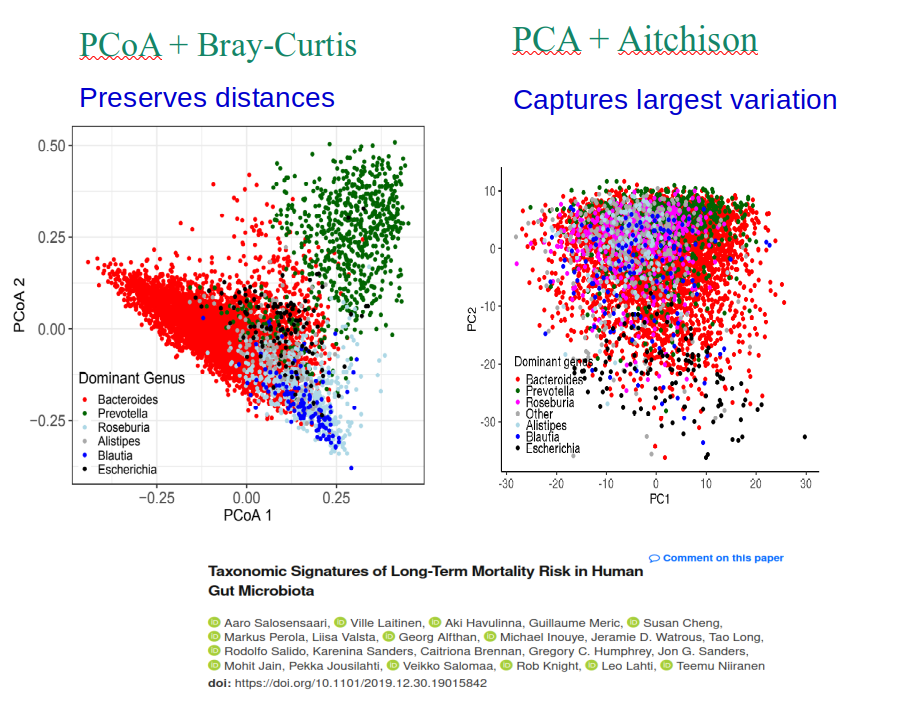

## Beta diversity

-   Similarity between samples
-   Dissimilarity/distance between samples, clustering, ordination...
-   Identify patterns of **community variation across conditions or treatments**

::: notes
Umbrella term. Different methods. Goal is to identify patterns from microbial profiles.
:::

## Ordination

::: columns
::: {.column width="62%"}
{fig-alt="PCoA with Bray-Curtis versus PCA with Aitchison distance on gut microbiota data"}
:::

::: {.column width="38%"}
  

::: {style="font-size: 0.8em;"}
Different distances and methods highlight different aspects of community variation.
:::

 

::: cta
[Ordination →](https://microbiome.github.io/outreach/ordination.html)
:::
:::
:::
