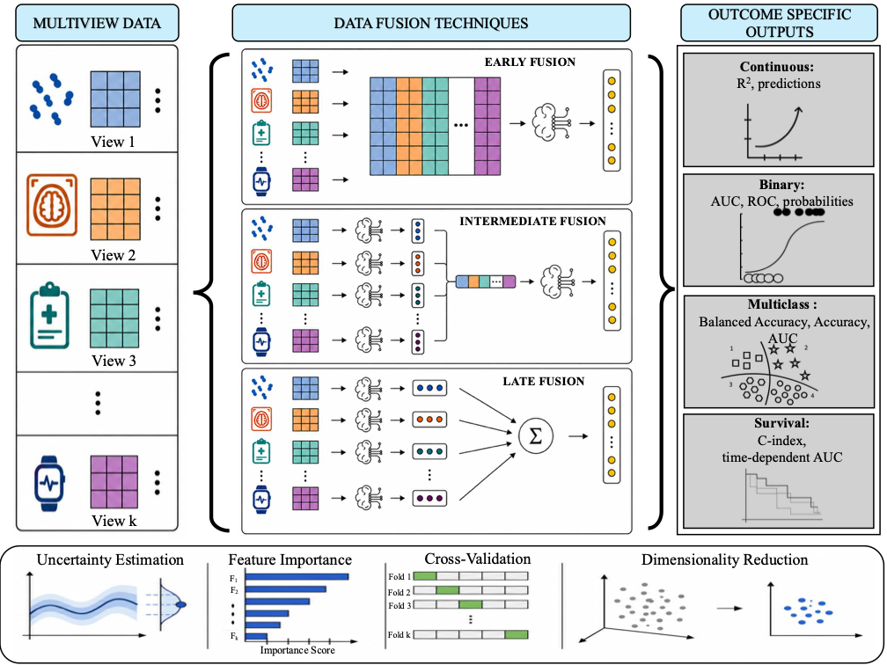

<!--
Overview of Mallick et al. (2024) Statistics in Medicine,
doi:10.1002/sim.9953, with R examples from the IntegratedLearner package.
The article is not open access: its figures are not reproduced here.
The workflow figure is from the IntegratedLearner GitHub repository
(MIT licence). All other plots are generated by the R code in this deck.

The examples run BART (bartMachine), which needs Java >= 21 and the
IntegratedLearner package (BiocManager::install("himelmallick/IntegratedLearner")).
Results are frozen (freeze: auto) so that a full-site render does not
re-run them.
-->

## The paper

**An integrated Bayesian framework for multi-omics prediction and classification**
[@mallick2024]

*Statistics in Medicine* 43(5):983–1002 (2024)
[doi:10.1002/sim.9953](https://doi.org/10.1002/sim.9953)

. . .

-   **Supervised** multi-omics integration: predict a phenotype or
    clinical outcome from several omics layers
-   **Late fusion**: one Bayesian model per layer, then an optimally
    weighted combination
-   **Uncertainty**: credible intervals for predictions and feature
    importance
-   R/Bioconductor package
    [IntegratedLearner](https://github.com/himelmallick/IntegratedLearner)

# Motivation

## Supervised multi-omics integration

Goal: find **multi-omics biomarkers that predict an outcome** (disease
status, gestational age, time to labor, ...)

Earlier approaches and their gaps:

::: {style="font-size: 0.85em"}
| Approach | Example | Gap |
|----|----|----|
| Concatenation | random forest on pooled features [@Franzosa2019] | layers differ in size, scale and noise |
| Stacked generalization | elastic net / LASSO stacking [@Ghaemi2019; @Stelzer2021] | no proper CV in the meta-learner → overfitting, leakage |
| sGCCA | DIABLO [@Singh2019] | categorical outcomes only; costly tuning; majority vote |
| Deep learning | | "black box", hard to interpret |
:::

. . .

None of these **quantify uncertainty** of the predictions or feature
importance.

# The method

## Fusion strategies

{fig-align="center" height="560"}

::: {style="font-size: 0.6em"}
Figure: IntegratedLearner GitHub repository (MIT licence). The paper's
default is **late fusion** with BART base learners.
:::

## The IntegratedLearner algorithm

For $K$ omics layers measured on the same samples:

1.  **Adjust** each layer for confounders and batch effects (optional)
2.  **Preprocess and filter** each layer (optional)
3.  **Base learners**: fit a BART model per layer to predict the outcome
    (cross-validated)
4.  **Meta-learner**: combine the out-of-sample layer predictions with
    non-negative weights

. . .

The final model is a **weighted average of per-layer tree ensembles**

-   Layer weights are interpretable: which omics carry the signal?
-   Each layer keeps its own scale, noise and normalization

## Base learner: Bayesian additive regression trees

A **sum of many small trees**, each a weak learner [@Chipman2010]:

$$
y = \sum_{j=1}^{m} g(\mathbf{x}; T_j, M_j) + \epsilon,
\qquad \epsilon \sim N(0, \sigma^2)
$$

-   $T_j$: tree structure; $M_j$: terminal-node values
-   Regularization priors keep each tree small, so no single tree
    dominates
-   Binary outcomes via a probit link:
    $P(Y = 1 \mid \mathbf{x}) = \Phi\big(\sum_j g(\mathbf{x}; T_j, M_j)\big)$
-   Fitted by **backfitting MCMC** → full posterior

. . .

What BART gives for free:

-   Nonlinear effects and interactions **within** a layer
-   Posterior samples → **credible and prediction intervals**
-   **Variable inclusion proportions** as feature importance

## Meta-learner: combining the layers

Stack the $V$-fold out-of-sample predictions $\hat{y}_{ik}$ of each
layer $k$ as "level 1" data.

**Continuous outcome**: non-negative least squares

$$
\hat{\boldsymbol\alpha} = \arg\min_{\alpha_k \ge 0}\;
\sum_{i}\Big(y_i - \sum_{k=1}^{K}\alpha_k\,\hat{y}_{ik}\Big)^2
$$

**Binary outcome**: minimize the rank loss $1 - \mathrm{AUC}$ of the
combined score $\sum_k \alpha_k \hat{p}_{ik}$, with $\alpha_k \ge 0$

. . .

-   The weights $\alpha_k$ show each layer's **relative contribution**,
    and hint at which omics are worth measuring in future studies
-   No second CV loop in the meta-learner, which avoids overfitting
    and data leakage
-   Weighted posterior samples $\sum_k \alpha_k\, \hat{y}^{(s)}_{ik}$
    give the **uncertainty of the fused prediction**

## Longitudinal biomarkers: two-stage model

Repeated omics measurements, cross-sectional outcome (e.g. IBD status)

**Stage 1**: per-feature linear mixed model

$$
x_{ij} = \mathbf{w}_{ij}^T \boldsymbol\beta + \mathbf{z}_{ij}^T \mathbf{b}_i + \epsilon_{ij}
$$

-   Fixed effects $\boldsymbol\beta$: per-layer confounders
-   Random effects $\mathbf{b}_i$ (here random intercepts): each
    subject's own level

**Stage 2**: use the predicted random effects $\hat{\mathbf{b}}_i$ as
features in IntegratedLearner

. . .

Keeps within-subject information that a cross-sectional model would
discard.

## Other features

-   **Missing layers in new data**: re-learn only the meta-learner
    weights on the available layers; the base learners are not refitted
-   **Residualization** of confounders (e.g. age, antibiotics) before
    learning
-   **Flexible learners**: any SuperLearner model as base or meta
    learner (random forest, elastic net, LASSO, ...)
-   **Early fusion** (concatenated model) fitted alongside for
    comparison

# Results

## Data sets

| Study | Subjects | Samples | Layers | Outcome |
|----|----|----|----|----|
| PRISM (discovery) | 155 | 155 | metabolomics, microbiome | IBD vs. non-IBD |
| PRISM (validation) | 65 | 65 | metabolomics, microbiome | IBD vs. non-IBD |
| iHMP | 132 | 1785 | metabolomics, microbiome | IBD vs. non-IBD (longitudinal features) |
| Pregnancy (Ghaemi et al.) | 17 | 51 | 7 layers | gestational age |
| Labor onset (Stelzer et al.) | 53 + 8 | 150 + 21 | metabolome, proteome, immune | time to labor, gestational age |

Plus simulations from TCGA ovarian cancer multi-omics (InterSIM).

## IBD classification: PRISM

-   Two layers: 8831 metabolites, 340 microbial species
-   Features **residualized** for age and antibiotic use
-   Compared with the concatenated random forest of Franzosa et al. (2019)

. . .

Findings:

-   All classifiers clearly beat random: AUC 0.93–0.96 in 5-fold CV,
    0.75–0.96 on the independent validation cohort
-   **Species contributed more** to the fused prediction than
    metabolites, despite far fewer features: predictive power does not
    follow layer size
-   IntegratedLearner **outperformed Franzosa et al. on external
    validation**, and also stacked elastic net and DIABLO
-   Wide 95% credible intervals reflect a heterogeneous "non-IBD"
    group: a single point estimate would be misleading

## Gestational age: pregnancy multi-omics

-   7 layers, 17 women, 3 time points each; leave-one-subject-out CV
-   Compared many base × meta learner combinations in one framework

. . .

-   **BART + NNLS** was among the best methods
-   Fused models beat every single-layer model, across algorithms
-   Concatenation did not beat the ensemble
-   Top layers by weight: microbiome, metabolomics, plasma SomaLogic

## Longitudinal biomarkers: iHMP

-   Predict **IBD status per subject** from up to 24 time points of
    metagenomics and metabolomics
-   Two-stage approach: random intercepts → BART → NNLS

. . .

-   Best cross-validated AUC among the compared methods
-   **Metabolomics** carried the largest weight
-   Top features agree with the original univariate analysis: loss of
    obligate anaerobes and butyrate producers (e.g. *Roseburia hominis*),
    enrichment of bile-acid products
-   Also finds sets of **weakly predictive features that are jointly
    strongly predictive**

## Missing layers: labor onset

-   Training: metabolome, proteome and immune layers
-   Validation cohort: **metabolomics missing**

. . .

-   Re-learn only the layer weights on the layers available in both
    cohorts; base learners are reused
-   Beat the LASSO stacking of the original study (Stelzer et al.) for
    both time to labor and gestational age
-   **Proteomics** was the top contributor, before and after the update
-   Existing methods would have to drop non-matching layers already
    during training

## Simulations

TCGA-like multi-omics (InterSIM): 131 genes, 367 methylation sites, 160
proteins; $n$ = 200, 500, 1000; SNR = 1, 5, 10; 100 replicates

| Scenario | IntegratedLearner vs. stacked linear models |
|----|----|
| Highly nonlinear (Friedman function) | **best in all 9 settings** (e.g. $R^2$ 0.81 vs. 0.63 at $n$ = 1000, SNR 10) |
| Highly linear | best in 5 of 9 settings |
| Fully linear | second best: regularized linear models win; always beats concatenated RF |

. . .

Runtime is on par with the frequentist methods, even though it
combines MCMC with cross-validation, thanks to the fast *bartMachine*
implementation of BART.

# In practice

## The R package today

The GitHub version extends the paper's method:

-   Input: **MultiAssayExperiment** (recommended) or legacy PCL lists
-   Outcomes: continuous, binary, **multiclass**, **survival**
-   Fusion: early (`run_concat`), late (`run_stacked`), and
    intermediate / cooperative learning (`run_intermediate`, via
    *multiview*)
-   Fold-safe feature filtering and supervised screening
-   Base learners: `sl_bart` (paper default, needs Java ≥ 21), any
    SuperLearner `SL.*` learner, and native multiclass and survival
    learners

```{r}
#| eval: false
BiocManager::install("himelmallick/IntegratedLearner")
```

```{r}
#| label: setup
#| cache: false
#| include: false
# bartMachine (sl_bart) needs Java >= 21; set JVM options before loading it
options(java.parameters = c("-Xmx6G", "--add-modules=jdk.incubator.vector"))
```

## Example 1: IBD classification (PRISM)

Train on PRISM, validate on an independent cohort (NLIBD)

```{r}
#| label: data-binary
library(IntegratedLearner)
library(MultiAssayExperiment)

data("PRISM_MAE", package = "IntegratedLearner")   # training
data("NLIBD_MAE", package = "IntegratedLearner")   # validation

experiments(PRISM_MAE)
table(IBD = colData(PRISM_MAE)$Y)
```

## Fit: BART per layer + NNLS/AUC meta-learner

```{r}
#| label: fit-binary
#| results: hide
fit_bin <- IntegratedLearner(
  MAE_train = PRISM_MAE,
  MAE_valid = NLIBD_MAE,
  folds = 5,
  base_learner = "sl_bart",        # BART base learners (paper default)
  meta_learner = "sl_nnls_auc",    # non-negative weights, maximize AUC
  filter_method = "prevalence", filter_pct = 40,
  run_screening = TRUE, screen_pct = 30,
  print_learner = FALSE,
  family = binomial()
)
```

::: {style="font-size: 0.8em"}
Also fits the **concatenated** model (early fusion) for comparison.
Filtering and screening are fold-safe (learned only on training folds).
:::

## Results: AUC and layer weights

::: columns
::: {.column width="45%"}
```{r}
#| label: auc-binary
round(rbind(
  train = fit_bin$AUC.train,
  valid = fit_bin$AUC.test
), 2)

# Layer weights of the stacked model
fit_bin$weights
```
:::

::: {.column width="55%"}
```{r}
#| label: roc-binary
#| echo: false
#| fig-width: 6
#| fig-height: 7.5
#| out-height: 560px
IntegratedLearner:::plot.learner(fit_bin)$plot
```
:::
:::

## What does this example show?

-   In cross-validation all models reach AUC ≈ 0.9
-   The meta-learner puts **nearly all weight on species**, echoing the
    paper: the smaller layer carries more signal
-   On the **independent cohort** AUC drops for the single layers and the
    stacked model; in this run the concatenated model generalizes best
-   With **random forests** (same settings) external AUC is similar or
    lower (stacked 0.64); weights shift to species 0.60, metabolites 0.40
-   The packaged PRISM data are a reduced version (1500 metabolites)
    without the paper's residualization of confounders; results also
    vary slightly between runs (MCMC)

. . .

Lesson: **always check external validation**, and compare the fusion
strategies on your own data; IntegratedLearner makes that comparison
easy.

## Example 2: gestational age (pregnancy)

7 omics layers, 17 women, repeated samples; continuous outcome

```{r}
#| label: fit-continuous
#| results: hide
data("pregnancy_MAE", package = "IntegratedLearner")

fit_cont <- IntegratedLearner(
  MAE_train = pregnancy_MAE,
  folds = 5,
  base_learner = "sl_bart",
  meta_learner = "sl_nnls_auc",
  filter_method = "variance", filter_pct = 40,
  run_screening = TRUE, screen_pct = 30,
  print_learner = FALSE,
  family = gaussian()
)
```

## Results: prediction accuracy and layer weights

::: columns
::: {.column width="45%"}
```{r}
#| label: r2-continuous
data.frame(
  R2     = round(fit_cont$R2.train, 2),
  weight = round(fit_cont$weights[names(fit_cont$R2.train)], 2)
)
```

::: {style="font-size: 0.8em"}
As in the paper, the stacked model beats every single layer, and
metabolomics, microbiome and plasma SomaLogic get the largest weights.
:::
:::

::: {.column width="55%"}
```{r}
#| label: weights-continuous
#| echo: false
#| fig-width: 6
#| fig-height: 5
library(ggplot2)
w <- data.frame(layer = names(fit_cont$weights), weight = fit_cont$weights)
ggplot(w, aes(reorder(layer, weight), weight)) +
  geom_col(fill = "darkseagreen") +
  coord_flip() +
  labs(x = NULL, y = "Layer weight (NNLS)") +
  theme_bw(base_size = 14)
```
:::
:::

## Uncertainty: credible intervals

Weight the posterior draws of each layer's BART model by the layer
weights:

```{r}
#| label: posterior
post <- lapply(seq_along(fit_cont$weights), function(k) {
  m <- fit_cont$model_fits$model_layers[[k]]
  X <- fit_cont$X_train_layers[[k]][, m$training_data_features, drop = FALSE]
  bartMachine::bart_machine_get_posterior(m, X)$y_hat_posterior_samples
})
post_fused <- Reduce(`+`, Map(`*`, post, fit_cont$weights))  # samples x draws
dim(post_fused)
```

## Uncertainty: credible intervals

```{r}
#| label: ci-plot
#| code-fold: true
#| fig-width: 12
#| fig-height: 5.5
library(bayesplot)
rownames(post_fused) <- rownames(fit_cont$X_train_layers[[1]])
y   <- setNames(fit_cont$Y_train, rownames(post_fused))
ord <- names(sort(rowMeans(post_fused)))

mcmc_intervals(t(post_fused), prob = 0.68, prob_outer = 0.95) +
  scale_y_discrete(limits = ord) +
  geom_point(aes(x = y[ord], y = ord), shape = 1, size = 2) +
  coord_flip() +
  labs(x = "Gestational age", y = "Samples (fitted, training data)") +
  theme_bw(base_size = 14) +
  theme(axis.text.x = element_blank())
```

::: {style="font-size: 0.8em"}
Thick (thin) bars: 68% (95%) credible intervals of the fused prediction;
circles: observed values.
:::

## Feature importance: BART inclusion proportions

```{r}
#| label: vimp
#| code-fold: true
#| fig-width: 12
#| fig-height: 5
top_layer <- names(which.max(fit_cont$weights))
invisible(capture.output(  # silence progress output
  vi <- bartMachine::investigate_var_importance(
    fit_cont$model_fits$model_layers[[top_layer]], plot = FALSE
  )
))
top <- head(sort(vi$avg_var_props, decreasing = TRUE), 10)
df  <- data.frame(feature = substr(names(top), 1, 45), prop = top,
                  sd = vi$sd_var_props[names(top)])

ggplot(df, aes(reorder(feature, prop), prop)) +
  geom_col(fill = "lightsalmon") +
  geom_errorbar(aes(ymin = pmax(prop - sd, 0), ymax = prop + sd), width = 0.2) +
  coord_flip() +
  labs(x = NULL, y = "Inclusion proportion", title = top_layer) +
  theme_bw(base_size = 14)
```

## Other options

```{r}
#| eval: false
# Swap learners: any SuperLearner model as base / meta learner
IntegratedLearner(MAE_train = mae, base_learner = "SL.randomForest",
                  meta_learner = "sl_nnls_auc", family = binomial())

# Multiclass outcome (native multiclass backend)
IntegratedLearner(MAE_train = mae, outcome_col = "diseaseCat",
                  base_learner = "randomforest", meta_learner = "randomforest",
                  family = binomial())

# Survival outcome
IntegratedLearner(MAE_train = mae, base_learner = "surv.coxph")

# Intermediate fusion: cooperative learning (multiview)
IntegratedLearner(MAE_train = mae, run_intermediate = TRUE,
                  family = binomial())

# New data with missing layers: re-learn only the layer weights
update.learner(fit, feature_table_valid = ft, feature_metadata_valid = fm,
               sample_metadata_valid = sm)
```

## Limitations and open questions

-   Base learners are fitted **per layer**: no information sharing
    between layers in the first stage
-   BART captures interactions **within** a layer, not **across** layers
-   The two-stage longitudinal model does not model **time** explicitly
-   Only whole-layer missingness is handled, not missing features within
    a layer
-   Weighted feature importance (layer weight × within-layer importance)
    can be dominated by one layer
-   Prior knowledge (e.g. regulatory networks) is not yet used

## Take-home messages

-   IntegratedLearner **fits one Bayesian model per omics layer** and
    **learns how much to trust each layer**
-   Layer weights, feature inclusion proportions and credible intervals
    make the predictions **interpretable and uncertainty-aware**
-   Handles **longitudinal biomarkers** and **missing layers** in new data
-   Strongest when effects are **nonlinear**; with purely linear signal,
    regularized linear stacking can be better
-   Runs directly on a **MultiAssayExperiment**

## References

::: {#refs}
:::

::: {style="font-size: 0.7em"}
Software: <https://github.com/himelmallick/IntegratedLearner>. Workflow
figure from the IntegratedLearner repository (MIT licence).
:::
