<!--
Overview of Cordazzo Vargas et al. (2026) Mol Syst Biol,
doi:10.1038/s44320-026-00236-3. Figures are cropped from the article
(CC BY 4.0).
-->

## The paper

**Joint-RPCA: domain-aware multi-omics integration for systems microbiology**
[@CordazzoVargas2026]

*Molecular Systems Biology* (2026)
[doi:10.1038/s44320-026-00236-3](https://doi.org/10.1038/s44320-026-00236-3)

. . .

-   Unsupervised, **joint dimensionality reduction** of multiple omics
    measured on the same samples
-   Built on **OptSpace** matrix completion, extending RPCA
    [@Martino2019]
-   Available in Python (*gemelli*, QIIME 2) and R (*mia*, Bioconductor)

# Motivation

## Why multi-omics integration?

Microbial ecosystems act through several interdependent layers:

-   taxonomic composition (metagenomics, 16S/18S)
-   gene expression (metatranscriptomics)
-   metabolite production and use (metabolomics)
-   proteins (proteomics)

Features in different layers are **not independent**: e.g. GABA is
produced by *Bacteroides* species.

## Why is it hard?

| Challenge            | What it means                                          |
|----------------------|--------------------------------------------------------|
| **Compositionality** | sequencing gives relative, not absolute, abundances    |
| **Sparsity**         | many zeros and missing values                          |
| **Scale differences**| each technology has its own units and magnitudes       |
| **High dimension**   | many more features than samples ($n \ll p$)            |

. . .

Common workarounds have limits:

-   **Separate PCoA per omic** ignores the links between layers
-   **Supervised models** assume relationships that are often unknown
-   **General-purpose multi-omics tools** (MOFA+, iCluster, intNMF,
    sPLS) were not designed for sparse compositional data

# The method

## Joint-RPCA in a nutshell

**Input**: $K$ data matrices (any number of omics) on a shared set of
samples

**Output**:

1.  a **joint sample space** $U$ shared by all omics (sample loadings)
2.  **feature loadings** $V_k$ for each omic, which can be ranked
3.  a **denoised feature–feature covariance** matrix, within and across
    omics

. . .

One framework for both **beta diversity** (ordination) and
**cross-modal feature associations**.

## Workflow

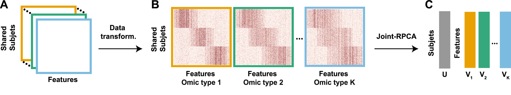{fig-align="center"}

::: {style="font-size: 0.7em"}
\(A\) $K$ omics on the same subjects → (B) per-omic transformation
→ (C) joint factorization into shared $U$ and omic-specific $V_1 \dots V_K$
:::

## Outputs

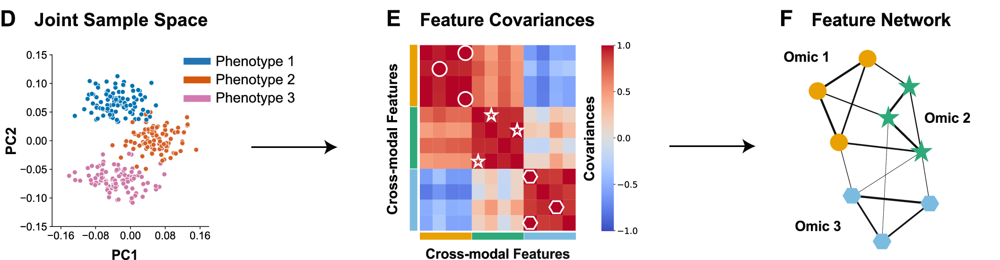{fig-align="center"}

::: {style="font-size: 0.7em"}
\(D\) joint sample space → (E) cross-modal feature covariances → (F)
feature network with intra- and inter-omic edges (toy data)
:::

## Key assumption: shared low-rank structure

$$
X = \mu + U V^T + E
$$

-   $\mu$: mean abundances; $UV^T$: low-rank signal; $E$: full-rank noise
-   **Low-rank**: the structured signal is captured by a few latent
    factors
-   A phenotype contrast (e.g. IBD vs. non-IBD) is often **rank-1**, yet
    it can explain only a *small* fraction of total variance
-   Joint-RPCA uses the other omics as **context** to recover this shared
    signal from high-rank noise

## Step 1: robust clr transformation

Each omic table is transformed separately:

$$
\mathrm{rclr}(x) = \left[\log\frac{x_1}{g_r(x)}, \dots, \log\frac{x_D}{g_r(x)}\right],
\qquad
g_r(x) = \Big(\prod_{i \in \Omega_x} x_i\Big)^{1/|\Omega_x|}
$$

-   $\Omega_x$: features observed (non-zero) in sample $x$
-   Zeros are treated as **missing**: no pseudocounts, no imputation
-   Other modality-specific preprocessing is allowed; rclr is the
    default and is recommended for sparse compositional data

## Step 2: joint matrix completion

Minimize the reconstruction error on **observed** entries only:

$$
\min_{U_{\mathrm{shared}},\,V_k}\;
\frac{1}{N}\sum_{k=1}^{N}
\left\| \Lambda\!\left( Y^k - U_{\mathrm{shared}}\, S\, V^{k\,T} \right) \right\|_2^2
$$

-   $U_{\mathrm{shared}}$: sample loadings, **shared** across omics
-   $V^k$: feature loadings, **specific** to omic $k$
-   $S$: diagonal matrix of shared singular values
-   $\Lambda$: mask for missing entries
-   Optimized by gradient descent (OptSpace); $U_{\mathrm{shared}}$ is
    re-orthogonalized by SVD at each iteration

With a single table, Joint-RPCA reduces to RPCA, plus cross-validation.

## Cross-validation and rank

-   Train on a subset of samples; **project** held-out samples into the
    learned space
-   The cross-validation error measures whether the representation
    generalizes:

$$
\frac{1}{N}\sum_{k=1}^{N}
\left\| \Lambda\!\left( Y^k_{\mathrm{test}} - (Y^k_{\mathrm{test}} V^k_{\mathrm{train}})\, W^{T}_{\mathrm{train}} \right) \right\|_2^2
$$

-   Used as a diagnostic to choose parameters (e.g. number of components)
-   Optional **rank estimation** from the singular value spectrum
-   In the paper, 2–3 components were enough: performance plateaued at
    $r = 3$

## Feature covariance

With $W^k = (S V^{k\,T})^T$, the feature contributions of omic $k$:

$$
\Sigma_{\mathrm{features}} =
\begin{bmatrix} W_1 \\ \vdots \\ W_K \end{bmatrix}
\begin{bmatrix} W_1 \\ \vdots \\ W_K \end{bmatrix}^T
$$

-   All features × all features, within and across omics
-   Denoised, because it is derived from the low-rank factors
-   Can be read as the adjacency matrix of a **multi-omics network**

# Benchmarks

## Benchmark design

**Data-driven simulations** (real iHMP data, 5 omics, IBD vs. non-IBD)

-   Sparsity induced in metagenomics by multinomial subsampling:
    12% → 3% observed density
-   Ten stratified 75/25 train–test splits

**Compared with**

-   Single-omic: PCoA (Bray–Curtis, Aitchison), RPCA
-   Multi-omic: MOFA+ [@argelaguet2020], iClusterPlus, intNMF, multiblock sPLS (mixOmics)

**Metrics**: Wilcoxon test per axis, PERMANOVA pseudo-F, Mahalanobis
distance between centroids, Random Forest classification error

## Phenotype separation (iHMP)

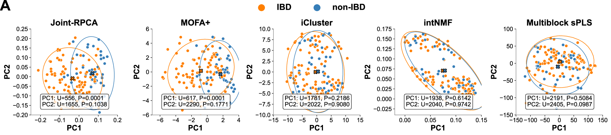{fig-align="center"}

Only Joint-RPCA and MOFA+ separate IBD from non-IBD along PC1.

## Robustness to sparsity

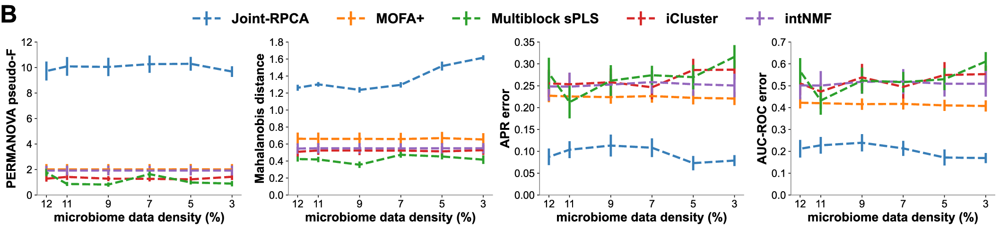{fig-align="center"}

::: {style="font-size: 0.8em"}
Joint-RPCA gives higher separation and lower classification error at
every simulated density: **up to sixfold** better classification accuracy.
:::

## Recovering the low-dimensional signal

-   **Feature stability**: the top metabolomic features on the
    IBD-associated axis overlap **60–70%** (median) across train/test
    splits for Joint-RPCA, vs. **< 30%** for MOFA+
-   **Synthetic data** (3 omics, rank-1 signal in 5–60 features):
    Joint-RPCA separates the groups at every signal strength and ranks
    the spiked features among its top loadings
-   **Effect size vs. dimensionality**: performance depends more on
    effect size than on sample size; it is stable when at least one omic
    carries a moderate to strong signal, but is sensitive when all omics
    have weak effects
-   Results are consistent across repeated runs

## Cross-modal associations: biocrust

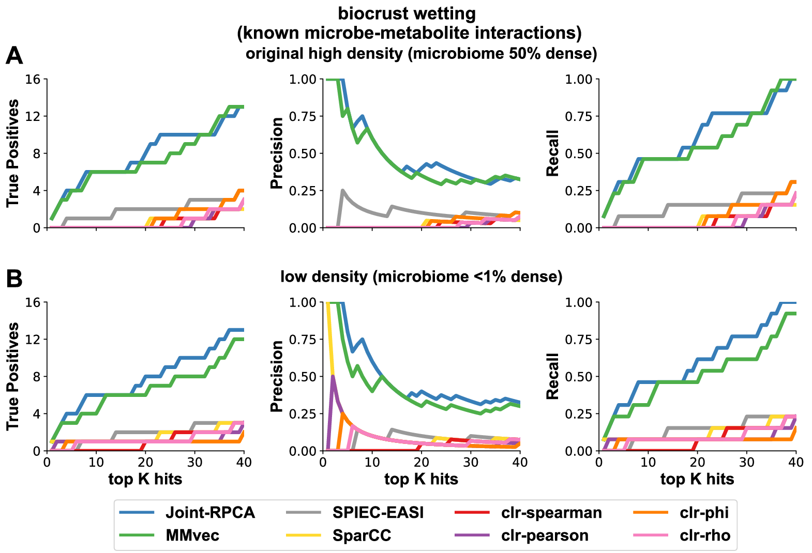{fig-align="center" height="520"}

::: {style="font-size: 0.7em"}
Known microbe–metabolite interactions (*M. vaginatus*) are recovered
about as well as by MMvec, and far better than by correlation-based
methods, even at < 1% density.
:::

## Runtime

::: columns
::: {.column width="30%"}
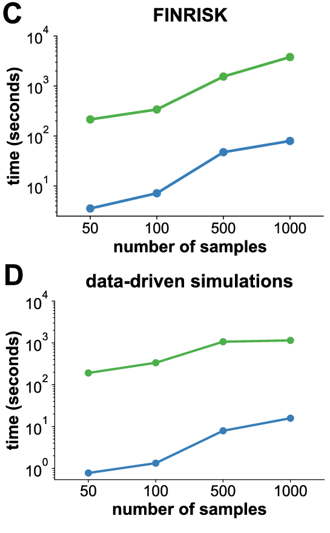
:::

::: {.column width="70%"}
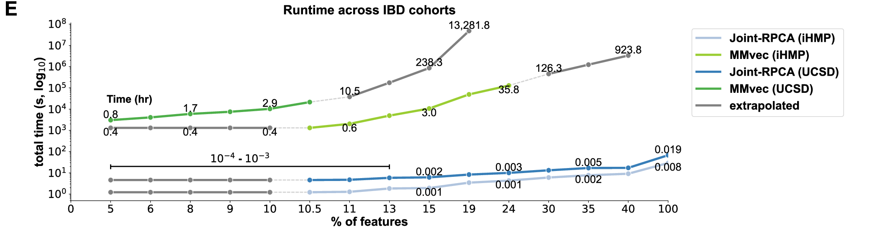

-   **~100× faster** than MMvec
-   MMvec scales with the number of *reads* and is pairwise only;
    Joint-RPCA scales with the number of *samples* and handles all omics
    at once
-   FINRISK: 7167 individuals
:::
:::

# Applications

## IBD: iHMP and replication

-   **iHMP**: 5 omics (metabolomics, proteomics, viromics, metagenomics,
    metatranscriptomics), 68 subjects
    -   IBD vs. non-IBD along PC1: PERMANOVA pseudo-F = 17.04, P = 0.0005
-   **UCSD cohort**: 3 omics, 146 subjects
    -   pseudo-F = 12.99, P = 0.0005
-   **Log-ratio** of the top vs. bottom PC1 features separates the groups
    in *every* omic, in both cohorts (t-test, P < 0.05)
-   Single-omic RPCA misses the signal in metatranscriptomics and
    metabolomics; Joint-RPCA finds it by using the other omics as context
-   Known markers are recovered: urobilin (non-IBD), *Klebsiella*
    (IBD)

## IBD signatures replicate across cohorts

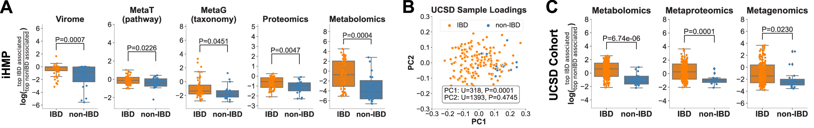{fig-align="center"}

## ... and generalize to a third dataset

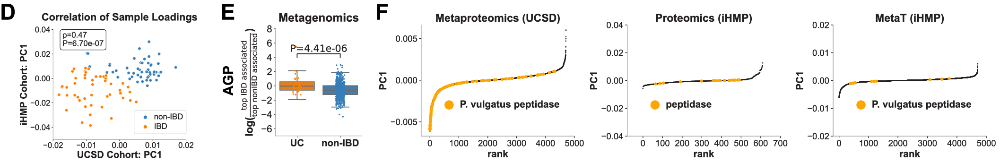{fig-align="center"}

::: {style="font-size: 0.75em"}
\(D\) iHMP vs. UCSD metagenomic rankings: ρ = 0.47, P = 6.7 × 10⁻⁷ ·
(E) the shared signature separates UC patients from 819 American Gut
controls · (F) *Phocaeicola vulgatus* peptidases are enriched in IBD in
metaproteomics, proteomics and metatranscriptomics
:::

## Human decomposition

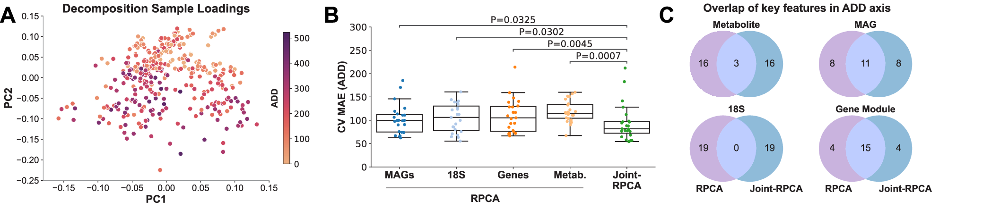{fig-align="center"}

::: {style="font-size: 0.75em"}
16S, 18S, metagenomics, metabolomics; 3 facilities, 23 donors.
(A) PC2 follows accumulated degree days (ADD) · (B) lower error when
predicting ADD than any single-omic RPCA · (C) finds the fungi
*Yarrowia* and *Candida* (18S), which single-omic RPCA misses
:::

## Mammalian gut microbiomes

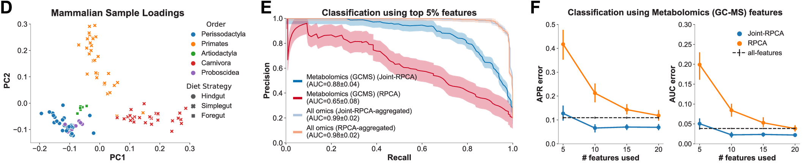{fig-align="center"}

::: {style="font-size: 0.75em"}
25 species, 5 omics. (D) Host taxonomy and diet strategy drive
variation · (E) GC-MS features alone: AUC 0.65 (RPCA) → **0.88**
(Joint-RPCA) · (F) a few jointly ranked features already predict well
:::

# In practice

## Software

-   **Python**: [gemelli](https://github.com/biocore/gemelli) (pip,
    conda), QIIME 2 plugin, Galaxy
-   **R / Bioconductor**: [mia](https://bioconductor.org/packages/mia)
    -   `getRPCA()`, `addRPCA()`: single table
    -   `getJointRPCA()`, `addJointRPCA()`: multiple tables in a
        *MultiAssayExperiment*
-   Analysis code: [Shenhav-Lab/Joint-RPCA-Manuscript](https://github.com/Shenhav-Lab/Joint-RPCA-Manuscript/)

## Example in R: iHMP subset

```{r}
#| label: jrpca-run
library(mia)

# iHMP subset: metagenomics (MGX) + metatranscriptomics (MTX)
data("ibdmdb", package = "mia")
mae <- ibdmdb

# Keep species-level metagenomic features
mgx <- rownames(mae[["MGX"]])
mae[["MGX"]] <- mae[["MGX"]][grepl("s__", mgx) & !grepl("t__", mgx), ]

# rclr per omic
mae[["MGX"]] <- transformAssay(mae[["MGX"]], assay.type = "mgx", method = "rclr")
mae[["MTX"]] <- transformAssay(mae[["MTX"]], assay.type = "mtx", method = "rclr")

# Joint-RPCA
set.seed(42)
mae <- addJointRPCA(mae, experiments = c("MGX", "MTX"),
                    assay.types = c("rclr", "rclr"), ncomponents = 3)
res <- metadata(mae)$JointRPCA
```

## Joint sample space

```{r}
#| label: jrpca-plot
#| output-location: column
#| fig-width: 5
#| fig-height: 4.5
library(ggplot2)

df <- data.frame(
  res[, 1:2],
  diagnosis = colData(mae)[rownames(res), "diagnosis"]
)

ggplot(df, aes(PC1, PC2, colour = diagnosis)) +
  geom_point(size = 3) +
  theme_minimal()
```

## Feature loadings

```{r}
#| label: jrpca-loadings
loadings <- attr(res, "rotation")

# Features with the strongest PC1 loadings, across both omics
top <- loadings[order(abs(loadings[, "PC1"]), decreasing = TRUE)[1:6], "PC1"]
data.frame(PC1 = round(top, 3), row.names = substr(names(top), 1, 60))

# Held-out reconstruction error
attr(res, "cv_error")
```

## Things to keep in mind

-   **Shared low-rank structure is assumed.** It can fail when a
    continuous gradient dominates (e.g. soil pH); the rank estimate
    warns when the data may not fit
-   **No adjustment for confounders**, as with other beta-diversity
    methods: validate separately
-   **Unequal omics**: the number of features and signal strength per
    omic affect how much each contributes; feature selection may help
-   **Time is not modelled**: in longitudinal data, time effects mix
    with the phenotype
-   The benchmarks cover **sparse, compositional settings**; other tools
    (e.g. MOFA+) may do better when their assumptions fit the data

## Take-home messages

-   Joint-RPCA gives **one shared ordination** of samples across any
    number of omics, plus **per-omic feature rankings** and a
    **cross-omic covariance network**
-   rclr + matrix completion handle **sparsity and compositionality**
    without pseudocounts
-   In benchmarks: better phenotype separation, stable feature
    selection, **~100× faster** than MMvec
-   Across IBD, decomposition and mammalian gut data, it **replicates
    across cohorts** and **strengthens weak omics** by adding context
-   Available in **gemelli** (Python) and **mia** (R/Bioconductor)

## References

::: {#refs}
:::

::: {style="font-size: 0.7em"}
Figures are adapted from @CordazzoVargas2026, published under
[CC BY 4.0](https://creativecommons.org/licenses/by/4.0/).
:::
