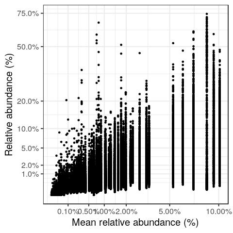
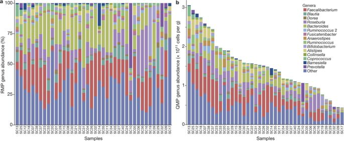
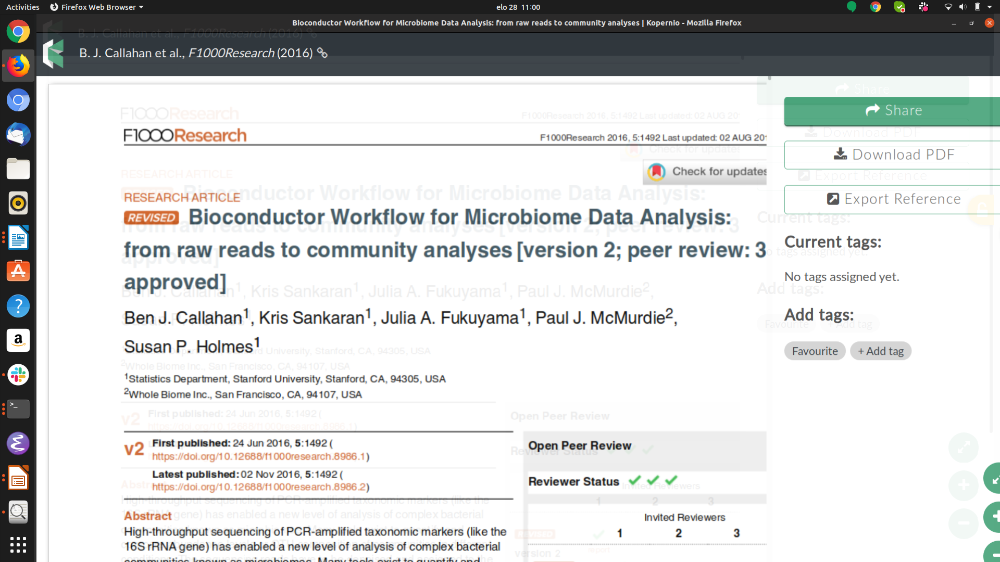
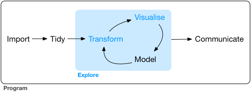
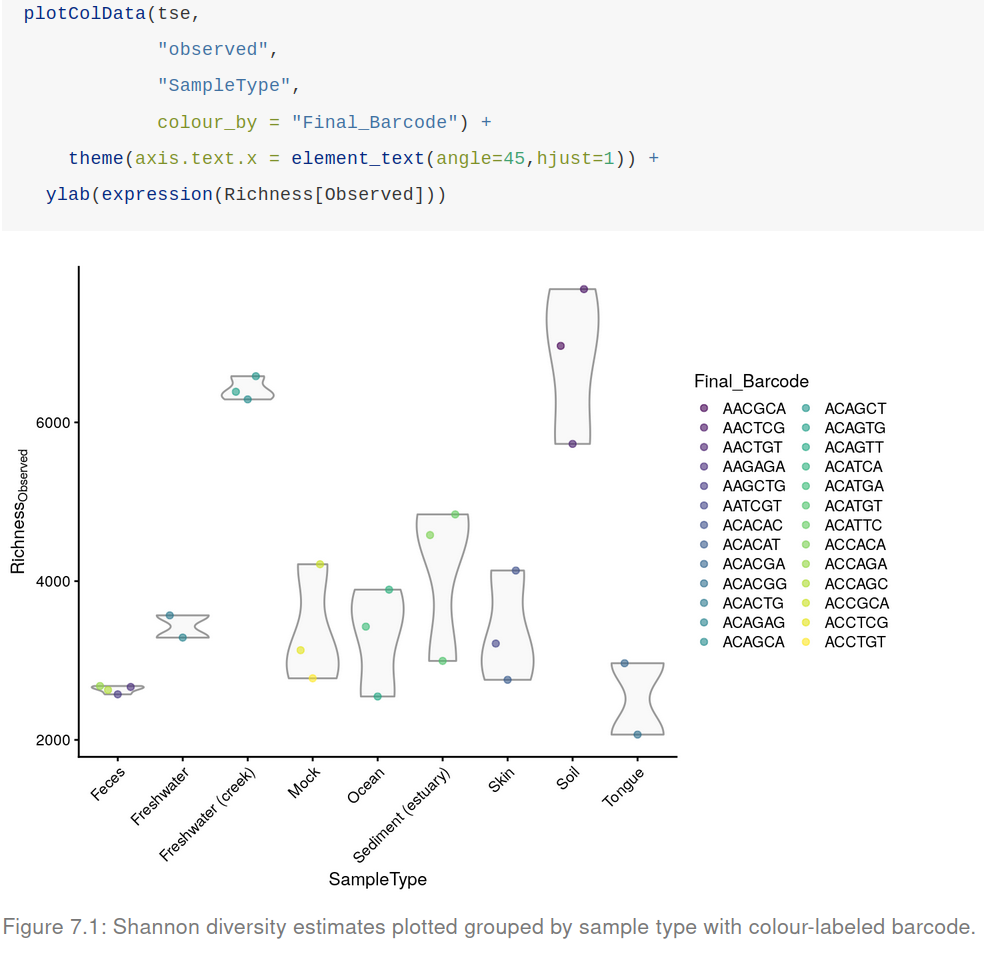
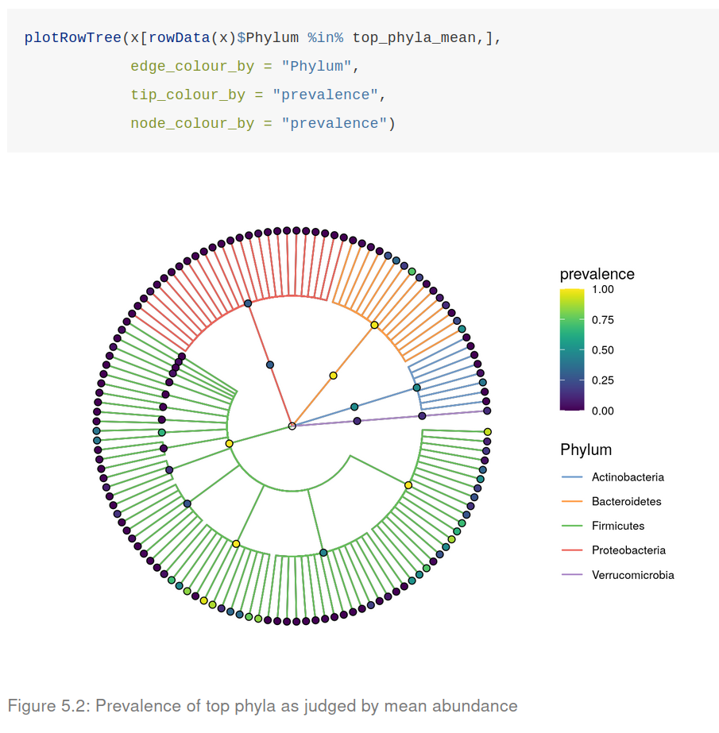

## {background-image="images/microbiome_data_science/slide02.jpg" background-size="contain"}

## {background-image="images/microbiome_data_science/slide03.jpg" background-size="contain"}

## Common study designs {.smaller}

- **Case-control & Intervention** — targeted experimental testing
- **Cross-sectional** — population (cohort) studies
- **Prospective** — long-term follow-ups
- **Longitudinal** — ecosystem dynamics

## Microbiome data properties {.smaller}

:::: {.columns}
::: {.column width="35%"}
- Sparse
- Non-Gaussian
- Overdispersed
- Compositional
- Complex
- Stochastic
- Hierarchical
:::
::: {.column width="65%"}
{width=45%}

{width=85%}
:::
::::

## {background-image="images/microbiome_data_science/slide06.jpg" background-size="contain"}

## Workflow for community analysis {.smaller}

:::: {.columns}
::: {.column width="40%"}
**Data import**

- Container preparation
- Sanity check (components)

**Data analysis**

- Alpha & beta diversity
- Differential abundance
- Etc.

**Reporting**

- Summaries
- Reproducible reporting
:::
::: {.column width="60%"}
{width=80%}

{width=70%}
:::
::::

## {background-image="images/microbiome_data_science/slide09.jpg" background-size="contain"}

## {background-image="images/microbiome_data_science/slide10.jpg" background-size="contain"}

## Data analysis & visualization {.smaller}

:::: {.columns}
::: {.column width="40%"}
[**Data import**]{style="color: gray;"}

- [Container preparation]{style="color: gray;"}
- [Sanity check (components)]{style="color: gray;"}

**Data analysis**

- Alpha & beta diversity
- Differential abundance
- Etc.

[**Reporting**]{style="color: gray;"}

- [Summaries]{style="color: gray;"}
- [Reproducible reporting]{style="color: gray;"}
:::
::: {.column width="60%"}
{width=75%}
:::
::::

## Typical tasks in community analysis {.smaller}

:::: {.columns}
::: {.column width="55%"}
**Standard:**

- Community diversity (alpha diversity)
- Community similarity (beta diversity)
- Differential abundance analysis

**Frequent:**

- Community typing
- Co-occurrence networks
- Phylogenetic balances
:::
::: {.column width="45%"}

:::
::::

## {background-image="images/microbiome_data_science/slide13.jpg" background-size="contain"}

## Workflow for community analysis {.smaller}

**Data import**

- Container preparation
- Sanity check (components)

**Data analysis**

- Exploration
- Analysis & modeling

**Reporting**

- Summaries
- Reproducible reporting

## {background-image="images/microbiome_data_science/slide15.jpg" background-size="contain"}

## {background-image="images/microbiome_data_science/slide16.jpg" background-size="contain"}

## {background-image="images/microbiome_data_science/slide17.jpg" background-size="contain"}

# Microbiome package ecosystem

## {background-image="images/microbiome_data_science/slide19.jpg" background-size="contain"}

## {background-image="images/microbiome_data_science/slide20.jpg" background-size="contain"}

## {background-image="images/microbiome_data_science/slide21.jpg" background-size="contain"}

## {background-image="images/microbiome_data_science/slide22.jpg" background-size="contain"}

## {background-image="images/microbiome_data_science/slide23.jpg" background-size="contain"}

## {background-image="images/microbiome_data_science/slide24.jpg" background-size="contain"}

## {background-image="images/microbiome_data_science/slide25.jpg" background-size="contain"}

## {background-image="images/microbiome_data_science/slide26.jpg" background-size="contain"}

## {background-image="images/microbiome_data_science/slide27.jpg" background-size="contain"}

## {background-image="images/microbiome_data_science/slide28.jpg" background-size="contain"}

## {background-image="images/microbiome_data_science/slide29.jpg" background-size="contain"}

## mia: example methods {.smaller}

**Compositional (Aitchison) transformations:**

```r
x <- transformSamples(tse, method = "clr", pseudocount = 1)
```

[Takes advantage of vegan transformations.]{.smaller}

**Phylogeny-aware distance metrics:**

```r
calculateUnifrac(tse, weighted = TRUE)
```

[Unifrac method by Rob Knight. Initial R/Bioc design for phyloseq Paul J. McMurdie. Adapted for mia/TreeSummarizedExperiment by Felix G.M. Ernst.]{.smaller}

## {background-image="images/microbiome_data_science/slide31.jpg" background-size="contain"}

## {background-image="images/microbiome_data_science/slide32.jpg" background-size="contain"}

## {background-image="images/microbiome_data_science/slide33.jpg" background-size="contain"}

## {background-image="images/microbiome_data_science/slide34.jpg" background-size="contain"}

## {background-image="images/microbiome_data_science/slide35.jpg" background-size="contain"}

# Exercises

## {background-image="images/microbiome_data_science/slide37.jpg" background-size="contain"}

## {background-image="images/microbiome_data_science/slide38.jpg" background-size="contain"}

# Open data science

## {background-image="images/microbiome_data_science/slide39.jpg" background-size="contain"}

## {background-image="images/microbiome_data_science/slide40.jpg" background-size="contain"}

## {background-image="images/microbiome_data_science/slide41.jpg" background-size="contain"}

## {background-image="images/microbiome_data_science/slide42.jpg" background-size="contain"}

## {background-image="images/microbiome_data_science/slide43.jpg" background-size="contain"}

## {background-image="images/microbiome_data_science/slide44.jpg" background-size="contain"}

## {background-image="images/microbiome_data_science/slide45.jpg" background-size="contain"}

## {background-image="images/microbiome_data_science/slide46.jpg" background-size="contain"}

## {background-image="images/microbiome_data_science/slide47.jpg" background-size="contain"}

## {background-image="images/microbiome_data_science/slide48.jpg" background-size="contain"}

## {background-image="images/microbiome_data_science/slide49.jpg" background-size="contain"}

## {background-image="images/microbiome_data_science/slide50.jpg" background-size="contain"}

## {background-image="images/microbiome_data_science/slide51.jpg" background-size="contain"}

## {background-image="images/microbiome_data_science/slide52.jpg" background-size="contain"}

## {background-image="images/microbiome_data_science/slide53.jpg" background-size="contain"}

## {background-image="images/microbiome_data_science/slide54.jpg" background-size="contain"}

## {background-image="images/microbiome_data_science/slide55.jpg" background-size="contain"}

## {background-image="images/microbiome_data_science/slide56.jpg" background-size="contain"}

## {background-image="images/microbiome_data_science/slide57.jpg" background-size="contain"}

## {background-image="images/microbiome_data_science/slide58.jpg" background-size="contain"}

# Supplementary material

## {background-image="images/microbiome_data_science/slide59.jpg" background-size="contain"}

## {background-image="images/microbiome_data_science/slide60.jpg" background-size="contain"}

## Typical study designs {.smaller}

- Case-control studies
- Interventions
- Cross-sectional population cohorts
- Prospective follow-ups
- Longitudinal time series
- Multi-omics

## {background-image="images/microbiome_data_science/slide62.jpg" background-size="contain"}

## Lecture: Key concepts {.smaller}

- special properties of microbiome data
- data science workflows

- alpha diversity
- beta diversity
- differential abundance

## {background-image="images/microbiome_data_science/slide64.jpg" background-size="contain"}

## {background-image="images/microbiome_data_science/slide65.jpg" background-size="contain"}

## {background-image="images/microbiome_data_science/slide66.jpg" background-size="contain"}

## {background-image="images/microbiome_data_science/slide67.jpg" background-size="contain"}

## {background-image="images/microbiome_data_science/slide68.jpg" background-size="contain"}

## {.center}

> "I have begun to think that no one ought to publish biometric results, without lodging a well arranged and well bound manuscript copy of all his data, in some place where it should be accessible, under reasonable restrictions, to those who desire to verify his work."

Francis Galton (1901), *Biometrika* 1:1, pp. 7-10.

## {background-image="images/microbiome_data_science/slide70.jpg" background-size="contain"}

## {background-image="images/microbiome_data_science/slide71.jpg" background-size="contain"}

## {background-image="images/microbiome_data_science/slide72.jpg" background-size="contain"}

## {background-image="images/microbiome_data_science/slide73.jpg" background-size="contain"}

## {background-image="images/microbiome_data_science/slide74.jpg" background-size="contain"}

## {background-image="images/microbiome_data_science/slide75.jpg" background-size="contain"}

## Task {.smaller}

Create a clear reproducible report of the example data, including the following aspects:

- Data import
- Data exploration & summaries
- Alpha diversity
- Beta diversity
- Differential abundance analysis
- **Conclusions**

## {background-image="images/microbiome_data_science/slide77.jpg" background-size="contain"}

## {background-image="images/microbiome_data_science/slide78.jpg" background-size="contain"}

## {background-image="images/microbiome_data_science/slide79.jpg" background-size="contain"}

## {background-image="images/microbiome_data_science/slide80.jpg" background-size="contain"}

## {background-image="images/microbiome_data_science/slide81.jpg" background-size="contain"}

## {background-image="images/microbiome_data_science/slide82.jpg" background-size="contain"}

## {background-image="images/microbiome_data_science/slide83.jpg" background-size="contain"}

## {background-image="images/microbiome_data_science/slide84.jpg" background-size="contain"}

## {background-image="images/microbiome_data_science/slide85.jpg" background-size="contain"}

## {background-image="images/microbiome_data_science/slide86.jpg" background-size="contain"}

## Example / demonstration data sets

- R packages (mia, miaViz, miaTime)
- curatedMetagenomicData
- microbiomeDataSets
- MGnifyR

## {background-image="images/microbiome_data_science/slide88.jpg" background-size="contain"}

## {background-image="images/microbiome_data_science/slide89.jpg" background-size="contain"}

