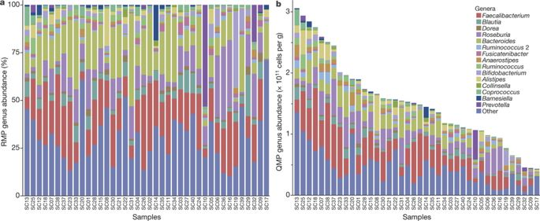
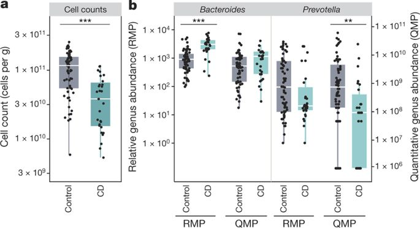

## Microbiome data

-   **High variability**: feature abundances vary widely across samples
-   **Zero-inflation**: many taxa absent in most samples
-   **Compositionality**: only relative abundances observed; total counts per sample are arbitrary

::: {.notes}

- **High variability** → lots of variation in abundances
- **Zero-inflation** → many features are absent in most samples, which complicates statistical modelling and increases sparsity of the data matrix.
- **Compositionality** → sequencing depth differs between samples; only *ratios* of features within a sample are meaningful, absolute counts are not.

:::

## Heteroscedasticity

```{r}
#| label: heteroscedasticity
#| fig-width: 7
#| fig-height: 4.2

library(ggplot2)

set.seed(42)

# Simulate heteroscedastic data: variance grows with x
x <- seq(1, 100, length.out = 200)
y <- 2 * x + rnorm(200, sd = x/2)  # noise increases with x

df1 <- data.frame(x, y)

ggplot(df1, aes(x, y)) +
  geom_point(alpha = 0.6) +
  geom_smooth(method = "lm", formula = y ~ x, se = FALSE, color = "#1a81a9") +
  theme_classic(base_size = 16) +
  labs(x = "Mean relative abundance", y = "Relative abundance")

```

::: {.notes}

Heteroscedasticity: the variance increases with the mean. Abundant taxa have lots of variability.

:::

## Zero-inflation

```{r}
#| label: zero_inflation
#| fig-width: 7
#| fig-height: 4.2

library(miaViz)
data("GlobalPatterns", package = "mia")
plotHistogram(GlobalPatterns, assay.type = "counts") +
    xlab("Count")
```

::: {.notes}

Real microbiome data. Lots of zeroes.

:::

## Compositionality

-   Sequencing measures **relative abundances**, not true microbial counts
-   Values are **parts of a whole**
-   Parts are **linked by a fixed total** (library size)
    -   If one increases, at least one other must decrease

::: {.notes}

Sequencing does not measure the true number of bacteria in a sample. Each sample produces an arbitrary total number of reads (library size) due to technical variation and bias.

Because all microbes share this fixed total, we observe only relative abundances, not absolute quantities.

Most standard statistical methods assume variables can change independently. Compositional data violate this assumption: all values must sum to the same total, so changes are always relative.

Ignoring this constraint can lead to misleading results, even when the data look reasonable.

Everyday examples of compositional data include:
- A budget
- How you spend 24 hours in a day (more work means less time for something else)
:::

## Absolute versus relative

```{r}
#| label: show_compositional
#| fig-width: 8
#| fig-height: 4.5

library(ggplot2)
library(dplyr)
library(tidyr)
library(patchwork)

# Absolute counts for 3 taxa in two samples: A triples, B and C stay constant
df <- tibble(
    Sample = c("Sample 1", "Sample 2"),
    A = c(50, 150),
    B = c(25, 25),
    C = c(25, 25)
) |>
    pivot_longer(-Sample, names_to = "Taxon", values_to = "Count") |>
    group_by(Sample) |>
    mutate(Proportion = Count / sum(Count)) |>
    ungroup()

pal <- c(A = "#1a81a9", B = "#87b13f", C = "#f2b134")

p1 <- ggplot(df, aes(x = Sample, y = Count, fill = Taxon)) +
    geom_col() +
    labs(title = "Absolute counts", x = NULL, y = "Count") +
    scale_fill_manual(values = pal) +
    theme_minimal(base_size = 16)

p2 <- ggplot(df, aes(x = Sample, y = Proportion, fill = Taxon)) +
    geom_col() +
    labs(title = "Relative abundance", x = NULL, y = "Proportion") +
    scale_fill_manual(values = pal) +
    theme_minimal(base_size = 16)

p1 + p2 + plot_layout(guides = "collect") & theme(legend.position = "bottom")
```

::: {.notes}

These plots show the same two samples in two different ways.

On the left, we see absolute counts. Taxon A increases in Sample 2, while taxa B and C stay exactly the same.

On the right, we see relative abundances, which is what sequencing gives us. Because each sample has a fixed library size, all taxa must share the same total.

As taxon A takes up a larger share in Sample 2, the proportions of B and C go down — even though their true counts did not change.

This is compositional bias: changes in one taxon can make others appear to change simply because everything is expressed as proportions.

:::

## Relative vs. quantitative profiles

{fig-align="center" width="100%" fig-alt="Genus-level profiles of the same samples as relative (RMP, left) and quantitative (QMP, right) abundances."}

::: aside
RMP / QMP: relative / quantitative microbiome profiling. @Vandeputte2017
:::

::: notes
The same samples profiled in two ways. On the left, relative abundances (RMP): every sample sums to 100 %. On the right, quantitative abundances (QMP): relative profiles scaled by the microbial cell count per gram, measured with flow cytometry. Microbial load varies several-fold between samples, which the relative profile hides entirely.
:::

## RMP vs. QMP: conclusions can flip

{fig-align="center" fig-alt="Cell counts are lower in Crohn's disease; Bacteroides differs between groups under RMP but not QMP, while Prevotella differs under QMP but not RMP."}

::: aside
@Vandeputte2017
:::

::: notes
Crohn's disease (CD) patients have lower microbial loads (a). With relative profiling, Bacteroides appears enriched in CD; with quantitative profiling, that difference disappears, whereas Prevotella is significantly depleted in CD only under QMP (b).

Potentially drastic effect on conclusions!
:::

## Compositionality is not optional

> "… microbiome datasets generated by HTS are compositional because they have an arbitrary total imposed by the instrument."

> "… HTS datasets derived from microbiome studies can and should be treated as compositions at all stages of analysis."

::: aside
@Gloor2017, *Microbiome datasets are compositional: and this is not optional*
:::

::: notes
Quoted from the abstract of @Gloor2017. HTS = high-throughput sequencing.
:::

## Goals of transformation

-   Mitigate biases in abundances
-   Make features comparable across samples
-   Meet assumptions of downstream statistical analyses

::: {.notes}

- Transformations allow standard analyses like PCA, regression, correlation.
- Choose transformation depending on the problem: relative abundance, log, CLR, etc.

:::

## Relative abundance

>_Library sizes are arbitrary_

$$
\text{X}_{ij} = \frac{\text{Count}_{ij}}{\sum_{k=1}^m \text{Count}_{ik}}
$$

*where*

-   $i$ indexes the sample,
-   $j$ indexes the taxon,
-   $m$ is the total number of taxa.

::: {.notes}

Library sizes were arbitrary --> remove their effect.

- Library sizes differ between samples (sequencing depth varies), so raw counts are not directly comparable.
- Relative abundance converts counts to proportions within each sample, making samples comparable.
- Intuition: a relative abundance of 0.2 means “this taxon makes up 20% of this sample,” independent of total reads.

:::

## Log-transformed relative abundance

>_Library sizes are arbitrary and data zero-inflated_

$$
\text{X}_{ij} = \log \left( \text{Relative abundance}_{ij} + \epsilon \right)
$$

*where*

-   $\epsilon$ is a small pseudocount to avoid $\log(0)$.

::: {.notes}

Zero-inflated --> reduce the data skewness

Log-transform reduces skewness and makes differences among low-abundance taxa more visible, but a pseudocount is required to handle zeros.

:::

## Counts, proportions, logs

```{r}
#| label: relative_abundance
#| fig-width: 9
#| fig-height: 3.6

library(mia)
library(miaViz)
library(patchwork)

data("GlobalPatterns", package = "mia")
tse <- GlobalPatterns
tse <- transformAssay(tse, method = "relabundance")
tse <- transformAssay(tse, assay.type = "relabundance", method = "log10",
                      pseudocount = TRUE)

p1 <- plotHistogram(tse, assay.type = "counts") +
    xlab("Count")
p2 <- plotHistogram(tse, assay.type = "relabundance") +
    xlab("Relative abundance")
p3 <- plotHistogram(tse, assay.type = "log10") +
    xlab("log10(relative abundance)")
p1 + p2 + p3
```

::: {.notes}

The data is still constrained to relative abundances (0-1), but now in log-scale.

Because the total is fixed, the numbers depend on each other.

If one goes up, at least one of the others must go down. This is called a constraint.

:::

## Centered log-ratio (CLR)

>_Library sizes are arbitrary and values are dependent_

$$
\text{CLR}(x_i) = \log\left(\frac{x_i}{g(x)}\right),\quad
g(x) = \left(\prod_{j=1}^{D} x_j \right)^{1/D}
$$

-   $x_i$: abundance of bacteria $i$
-   $g(x)$: geometric mean across all bacteria in the sample

::: {.notes}

CLR is a standard transformation for compositional data. It accounts for
dependency between parts and arbitrary library sizes, which simple relative
abundance transformations cannot.

:::

## Intuition {auto-animate="true"}

1. Values dependent, only ratios matter

::: {.notes}

This is the idea behind CLR transformation.

When we want to compare values in compositional data, only ratios make sense.

:::

## Intuition {auto-animate="true"}

1. Values dependent, only ratios matter
2. Standard statistics rely on subtraction and distance

::: {.notes}

However, most statistical tests
rely on subtraction making sense. How to turn ratios into differences?

:::

## Intuition {auto-animate="true"}

1. Values dependent, only ratios matter
2. Standard statistics rely on subtraction and distance

$$
\frac{x}{y} \;\longrightarrow\; a - b \;?
$$

::: {.notes}

This is the situation.

:::

## Intuition {auto-animate="true"}

1. Values dependent, only ratios matter
2. Standard statistics rely on subtraction and distance
    - Use log-scale

$$
\log\left(\frac{x}{y}\right) = \log(x) - \log(y)
$$

::: {.notes}

Taking the log turns multiplicative relationships (ratios) into additive ones (differences), making subtraction meaningful.

:::

## Intuition {auto-animate="true"}

1. Values dependent, only ratios matter
2. Standard statistics rely on subtraction and distance
    - Use log-scale
3. Library sizes are arbitrary

::: {.notes}

Library sizes are arbitrary. This means that the scale of values are arbitrary. How to remove the effect of them?

:::

## Intuition {auto-animate="true"}

1. Values dependent, only ratios matter
2. Standard statistics rely on subtraction and distance
    - Use log-scale
3. Library sizes are arbitrary
    - Center the data

::: {.notes}

By centering the data, i.e., removing the mean.

:::

## Centering

```{r}
#| label: centering
#| fig-width: 8
#| fig-height: 4.2

library(ggplot2)

set.seed(123)

# Original normal distribution with positive mean
x <- rnorm(1000, mean = 5, sd = 1)
df <- data.frame(x = x)

# Centered version (subtract mean)
x_centered <- x - mean(x)
df_centered <- data.frame(x = x_centered)

# Combine for plotting
df_plot <- rbind(
  data.frame(x = x, type = "Original"),
  data.frame(x = x_centered, type = "Centered")
)

# Plot
ggplot(df_plot, aes(x = x, fill = type)) +
  geom_density(alpha = 0.5, position = "identity", show.legend = FALSE) +
  geom_vline(xintercept = mean(x), linetype = "dashed", color = "#1a81a9") +
  geom_vline(xintercept = mean(x_centered), linetype = "dashed", color = "#87b13f") +
  scale_fill_manual(values = c(Original = "#1a81a9", Centered = "#87b13f")) +
  annotate("segment", x = mean(x), xend = mean(x_centered), y = 0.15, yend = 0.15,
           arrow = arrow(length = unit(0.3,"cm")), color = "black") +
  annotate("text", x = (mean(x)+mean(x_centered))/2, y = 0.17, label = "Centering",
           hjust = 0.5, size = 5) +
  labs(title = "", x = "x", y = "Density") +
  theme_minimal(base_size = 16) +
  theme(legend.position = "none")

```

::: {.notes}

Centering means that we subtract mean from each value to get the distribution centered to 0. Because we use log-scale, we have to use suitable mean (geometric mean aka arithmetic mean in log-scale).

:::

## Centering the logs

$$
\begin{aligned}
\text{CLR}(x_i) &= \log\left(\frac{x_i}{g(x)}\right) \\[2mm]
&= \log(x_i) - \log(g(x))
\end{aligned}
$$

::: {.notes}

We remove the mean.

Why we remove geometric mean?

:::

## Why the geometric mean?

$$
\text{Arithmetic mean} = \frac{2 + 8 + 32}{3} = \frac{42}{3} = 14
$$

$$
\begin{aligned}
\text{Geometric mean} &= \sqrt[3]{2 \cdot 8 \cdot 32} \\[2mm]
&= \exp\left( \frac{\log 2 + \log 8 + \log 32}{3} \right) \\[2mm]
&= 8
\end{aligned}
$$

::: {.notes}

The geometric mean is just the arithmetic mean in log-space. Because now the
values are in logarithmic space, we have to use geometric mean.

:::

## Intuition: summary

1. Values dependent, only ratios matter
2. Standard statistics rely on subtraction and distance
    - Use log-scale
3. Library sizes are arbitrary
    - Center the data


::: {.notes}

CLR converts compositional data into a format where subtraction, distances, and
correlations make sense. This solves both the dependency and library size issues.

:::

## Centered log-ratio (CLR)

$$
\begin{aligned}
\text{CLR}(x_i) &= \log\left(\frac{x_i}{g(x)}\right) \\[2mm]
&= \log(x_i) - \log(g(x)) \\[2mm]
&= \log(x_i) - \frac{1}{D}\sum_{j=1}^{D}\log(x_j)
\end{aligned}
$$

::: {.notes}

- Take a logarithm of the values --> ratios become subtraction which is what we want in Euclidean space
- Center values to mean 0

- CLR values show how each feature compares to the sample’s geometric mean.
- Positive = enriched, Negative = depleted.
- Magnitude gives a fold-change interpretation on a log scale.

:::

## CLR in practice

-   Removes compositional constraints (constant sum)
-   Values centered around zero, symmetric
-   Allows standard statistical tools (PCA, correlations)
-   [Debate on whether it is necessary in DA](https://www.biorxiv.org/content/10.1101/2025.02.13.638109v1.full.pdf){preview-link="true"}

::: {.notes}

- CLR is widely used in microbiome data analysis because it removes compositional constraints and often makes data more normally distributed.

- However, recent benchmark studies highlight some limitations in differential abundance (DA) analysis:
  - Can lack sensitivity
  - May produce paradoxical results in low-diversity microbiomes
- CLR values are harder to interpret than relative abundances because each value is dependent on the other features in the sample

Despite this, CLR remains a standard, especially for methods that assume Euclidean space.

:::

## Counts versus CLR

```{r}
#| label: clr
#| fig-width: 8
#| fig-height: 3.6

library(mia)
library(miaViz)
library(patchwork)

data("GlobalPatterns", package = "mia")
tse <- GlobalPatterns
tse <- transformAssay(tse, method = "clr", pseudocount = TRUE)

p1 <- plotHistogram(tse, assay.type = "counts") +
    xlab("Count")
p2 <- plotHistogram(tse, assay.type = "clr") +
    xlab("CLR abundance")
p1 + p2
```

::: {.notes}

Makes the data more normally distributed. Distributed around zero. Without constrains (goes from negative infinity to positive)

:::

## Correct transformation depends on

1. Your research question
2. The analysis method

>_Use the simplest justified approach that works_

::: {.notes}

There is increasing amount of benchmarking literature on this.
We combine them to online book.

The “best” transformation depends on what you want to learn and the statistical
methods you plan to use. Often, a simple, well-justified approach works well in
practice.


:::


## Demonstration

```{r}
#| label: transformation
#| echo: true
library(mia)
data("GlobalPatterns", package = "mia")
tse <- GlobalPatterns

tse <- transformAssay(tse, method = "relabundance")
tse <- transformAssay(tse, method = "clr", pseudocount = TRUE)
assayNames(tse)
```

## Exercises

::: callout-tip
## OMA online book, Chapter 12: Transformation

[microbiome.github.io/OMA › Transformation](https://microbiome.github.io/OMA/docs/devel/pages/transformation.html)

**All exercises**
:::

## References

::: {#refs}
:::
