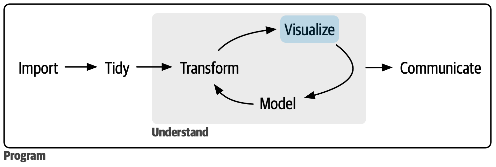

## The data science workflow

{fig-align="center" width="100%" fig-alt="Data science workflow: import, tidy, then an understand loop of transform, visualize and model, followed by communicate; programming surrounds all steps."}

::: aside
[R for Data Science](https://r4ds.hadley.nz) [@Wickham2023], CC BY-NC-ND 3.0
:::

::: notes
The general data science cycle from R for Data Science. Data are imported and tidied, then understood by iterating between transforming, visualizing and modelling, and finally the results are communicated. Programming surrounds every step and ties it together into a reproducible whole. The microbiome workflow on the next slide follows the same pattern.
:::

## A typical workflow

::: flow
[Import]{.step .navy}
[Preprocess]{.step .teal}
[Alpha]{.step .teal}
[Beta]{.step .coral}
[Taxa]{.step .coral}
[Report]{.step .gold}
:::

-   Key elements of a taxonomic profiling study
-   Mixed and matched in real case studies
-   Examples for each step in [OMA](https://microbiome.github.io/OMA/)

::: notes
This session gives an overview of the key elements of a typical data
science workflow in a taxonomic profiling study. Real case studies mix
these in various ways.
:::

## Your task

::: statement
Build a clear, compact and reproducible report on your data.
:::

::: cards
::: {.card .teal}
[📓]{.icon}

[Reproducible]{.card-title}

Quarto / R Markdown report that renders from raw data
:::

::: {.card .coral}
[🎯]{.icon}

[Selective]{.card-title}

Choose summaries and analyses that answer your question
:::

::: {.card .gold}
[📚]{.icon}

[Build on OMA]{.card-title}

Reuse material and examples from the [OMA book](https://microbiome.github.io/OMA/)
:::
:::

## Setup

```{r}
#| label: setup
library(mia)
library(miaViz)
library(scater)
library(patchwork)
set.seed(1)  # reproducible permutation tests

# Example data set: skin microbiome with sample metadata
data("peerj13075", package = "mia")
tse <- peerj13075

# Relative abundances and CLR for downstream steps
tse <- transformAssay(tse, method = "relabundance")
tse <- transformAssay(tse, method = "clr", pseudocount = TRUE)

# Genus-level summary
tse_genus <- agglomerateByRank(tse, rank = "genus")
```

::: notes
The workflow operates on a TreeSummarizedExperiment. Replace the
example data with your own.
:::

# Alpha diversity {background-color="#13a89e"}

## Alpha diversity: within-sample

::: columns
::: {.column width="45%"}
**Tasks**

1.  Estimate alpha diversity per sample
2.  Draw a histogram
3.  Compare two or more indices, visually and/or statistically
:::

::: {.column width="55%"}
```{r}
#| label: alpha
#| output-location: slide
#| fig-width: 8
#| fig-height: 3.6
tse <- addAlpha(
    tse, index = c("shannon", "observed"))

p1 <- plotHistogram(
    tse, col.var = "shannon", bins = 15)
p2 <- plotColData(
    tse, x = "observed", y = "shannon")
p1 + p2
```
:::
:::

```{r}
#| label: alpha_cor
#| echo: false
rho <- cor(tse$observed, tse$shannon, method = "spearman")
```

::: {.callout-tip}
Do richness and evenness agree? Here Spearman $\rho$ = `r round(rho, 2)`.
:::

# Beta diversity {background-color="#f26b5b"}

## Beta diversity: PCoA

Visualize community variation with **PCoA**, and check how the
data transformation affects it:

::: cards
::: {.card .coral}
[Bray–Curtis]{.card-title}

on compositional (relative abundance) data
:::

::: {.card .navy}
[Euclidean]{.card-title}

on CLR-transformed data (Aitchison distance)
:::
:::

```{r}
#| label: pcoa
#| output-location: slide
#| fig-width: 9
#| fig-height: 3.8
tse <- runMDS(tse, FUN = getDissimilarity, method = "bray",
              assay.type = "relabundance", name = "PCoA_BC")
tse <- runMDS(tse, FUN = getDissimilarity, method = "euclidean",
              assay.type = "clr", name = "PCoA_CLR")

plotReducedDim(tse, "PCoA_BC",  colour_by = "Geographical_location") +
plotReducedDim(tse, "PCoA_CLR", colour_by = "Geographical_location") +
    plot_layout(guides = "collect")
```

## Community-level comparisons

Does community composition differ between groups?

::: columns
::: {.column width="45%"}
-   **PERMANOVA** tests group differences in composition
-   Add **covariates** (e.g. age, sex) and see how the results change
-   Check homogeneity of dispersion
:::

::: {.column width="55%"}
```{r}
#| label: permanova
#| output-location: slide
res <- getPERMANOVA(
    tse,
    assay.type = "relabundance",
    method = "bray",
    formula = x ~ Geographical_location + Gender + Age,
    test.homogeneity = TRUE)

res$permanova |>
    knitr::kable(digits = 3)
```
:::
:::

::: notes
PERMANOVA is sensitive to differences in group spread (dispersion), not
only location, so check homogeneity of dispersion alongside the test
(`res$homogeneity`).
:::

# Taxa-level analysis {background-color="#0b2545"}

## Prevalence

What is the most **prevalent** genus in the data?

```{r}
#| label: prevalence
prev <- getPrevalence(
    tse_genus, assay.type = "relabundance",
    detection = 0, sort = TRUE)
round(head(prev, 4), 2)
```

[prevalence]{.pill} = fraction of samples where a taxon is detected
above a given abundance threshold

## Core microbiota

Taxa above **0.1 %** relative abundance in **over 50 %** of
samples [@Salonen2012]. How sensitive is this to the thresholds?

```{r}
#| label: core
#| output-location: column
#| fig-width: 4.5
#| fig-height: 3.4
core <- getPrevalent(
    tse_genus,
    assay.type = "relabundance",
    detection = 0.1 / 100,
    prevalence = 50 / 100)

plotAbundanceDensity(
    tse_genus[core, ],
    layout = "jitter",
    assay.type = "relabundance")
```

## Differential abundance

Which genera are associated with a group difference (e.g. sex)?

```{r}
#| label: deseq2
#| output-location: slide
library(DESeq2)

dds <- DESeqDataSet(tse_genus, design = ~ Gender)
dds <- DESeq(dds)
res <- results(dds)

top <- head(res[order(res$padj), ])
data.frame(log2FC = round(top$log2FoldChange, 2),
           padj = signif(top$padj, 2),
           row.names = rownames(top)) |>
    knitr::kable()
```

-   [DESeq2](https://bioconductor.org/packages/DESeq2) [@Love2014];
    for alternatives and benchmarks see the
    [OMA DAA chapter](https://microbiome.github.io/OMA/docs/devel/pages/differential_abundance.html)
-   Compare several methods: results can differ substantially

## Role of covariates

::: statement
Key covariates (diet, medication, age, …) can change the interpretation.
:::

-   Stool consistency, medication and diet explain a considerable part of
    population-level gut microbiome variation [@Falony2016]
-   Include relevant covariates in **PERMANOVA** and **differential
    abundance** models
-   Compare results with and without covariates

# Wrap-up {background-color="#f2b134"}

## Checklist for your report

::: cards
::: {.card .teal}
[Alpha]{.card-title}

Indices, histogram, comparison
:::

::: {.card .coral}
[Beta]{.card-title}

PCoA (BC vs CLR), PERMANOVA with covariates
:::

::: {.card .navy}
[Taxa]{.card-title}

Prevalence, core microbiota, differential abundance
:::

::: {.card .gold}
[Report]{.card-title}

Clear, compact, reproducible
:::
:::

## Resources

-   [Orchestrating Microbiome Analysis (OMA)](https://microbiome.github.io/OMA/)
-   [mia](https://bioconductor.org/packages/mia) and
    [miaViz](https://bioconductor.org/packages/miaViz) documentation
-   [DESeq2 vignette](https://bioconductor.org/packages/devel/bioc/vignettes/DESeq2/inst/doc/DESeq2.html)

## References
